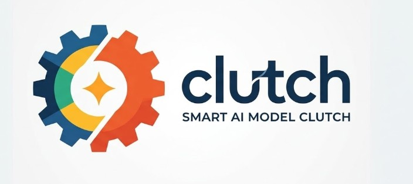

<p align="center">
  
</p>

# clutch

> Provider-neutral LLM orchestration engine with auto-learning


**clutch** (German: *Kupplung*) uses a driving metaphor to intelligently route tasks to optimal LLM models across multiple providers. It analyzes task complexity, selects the right model and reasoning level, tracks budgets, and learns from experience.

## Features

- **Provider-neutral** -- seamlessly switch between Anthropic (Claude), Google (Gemini), Ollama (local), and Claude Code
- **Auto-routing** -- analyzes task complexity and picks the optimal model + reasoning level
- **Budget tracking** -- four-zone fuel gauge (green/yellow/orange/red) with daily and monthly limits
- **Learning engine** -- fitness scoring and epsilon-greedy exploration that improves routing over time
- **Execution patterns** -- single tasks, chains (convoy), parallel teams, and swarm processing
- **Health monitoring** -- circuit breakers, latency tracking, and provider failover
- **SQLite metrics** -- persistent trip log for analysis and optimization

## Architecture

The entire system follows a **car/driving metaphor**:

```
                    +----------------------------------+
                    |            FAHRER                 |
                    |        (Driver / Orchestrator)    |
                    |     Any LLM: Opus, Gemini, ...   |
                    +--------+----------+--------------+
                             |          |
                +------------+          +-------------+
                |                                     |
        +-------v--------+                   +--------v-------+
        |    STRECKE      |                   |    GETRIEBE    |
        | (Road / Task    |                   | (Gearbox /     |
        |  Analysis)      |                   |  Model Registry|
        +----------------+                   |                |
                                              | G1: Haiku      |
        +----------------+                   | G2: Flash      |
        |   GAS / BREMSE  |                   | G3: Sonnet     |
        | (Throttle/Brake |                   | G4: Gemini Pro |
        |  Reasoning Lvl) |                   | G5: Opus       |
        +----------------+                   | + Ollama local |
                                              +----------------+
        +----------------+
        |    KUPPLUNG     |    +------------+    +-------------+
        | (Clutch / Model |    |   TACHO    |    |  TANKUHR    |
        |  Switching)     |    | (Metrics)  |    | (Budget)    |
        +----------------+    +------------+    +-------------+
```

| Component | Role | Module |
|-----------|------|--------|
| **Fahrer** (Driver) | Orchestrator -- picks model, reasoning, pattern | `fahrer.py` |
| **Strecke** (Road) | Task analysis and classification | `strecke.py` |
| **Getriebe** (Gearbox) | Provider-neutral model registry | `getriebe.py` |
| **Gang** (Gear) | A specific model (G1--G5) | `getriebe.py` |
| **Gas/Bremse** (Throttle/Brake) | Reasoning level (0--100%) | `gas_bremse.py` |
| **Kupplung** (Clutch) | Model switching mechanism | `kupplung.py` |
| **MotorBlock** (Engine) | Unified API call layer | `motorblock.py` |
| **Tacho** (Speedometer) | Metrics collection | `tacho.py` |
| **Tankuhr** (Fuel Gauge) | Budget tracking (4 zones) | `tankuhr.py` |
| **Bordcomputer** (Onboard Computer) | Health monitor, circuit breaker | `bordcomputer.py` |
| **Fahrtenbuch** (Trip Log) | SQLite metrics storage | `fahrtenbuch.py` |
| **Fahrschule** (Driving School) | Learning / evolution engine | `fahrschule.py` |

## Road Types

| Road | Difficulty | Default Gear | Throttle | Pattern |
|------|-----------|-------------|----------|---------|
| Feldweg (Dirt road) | Trivial | Haiku (G1) | 30% | Single |
| Landstrasse (Country road) | Standard | Sonnet (G3) | 50% | Single |
| Bundesstrasse (Highway) | Bugfix | Sonnet (G3) | 70% | Single |
| Autobahn (Motorway) | Architecture | Opus (G5) | 90% | Single |
| Rallye (Rally) | Bulk ops | Haiku (G1) | 30% | Swarm |
| Konvoi (Convoy) | Pipeline | Sonnet (G3) | 50% | Chain |
| Teamfahrt (Team drive) | Multi-file | Sonnet (G3) | 50% | Team |
| Langstrecke (Long distance) | Complex | Opus (G5) | 90% | Hybrid |

## Installation

```bash
git clone https://github.com/ellmos-ai/clutch.git
cd clutch
pip install -e .
```

### Requirements

- Python 3.10+
- API keys for your desired providers (set as environment variables):
  - `ANTHROPIC_API_KEY` for Claude models
  - `GOOGLE_API_KEY` for Gemini models
  - Ollama running locally for local models

## Quick Start

```python
from kupplung import Fahrer

# Create a driver (uses all configured providers)
fahrer = Fahrer()

# Describe your task -- the driver handles everything
result = fahrer.fahren(
    "Fix the authentication bug in the login module",
    handler=my_handler,
)

# Inspect what was chosen
print(result.config.gang.name)       # "claude-sonnet"
print(result.config.gang.provider)   # "anthropic"
print(result.config.gas.wert)        # 0.7

# Dashboard
status = fahrer.status()
print(status["tankuhr"]["zone"])     # "green"
print(status["getriebe"])            # "Getriebe[haiku(G1), flash(G2), ...]"

# Learn from past runs
fahrer.trainieren()
```

## Configuration

All config lives in `config/`:

| File | Purpose |
|------|---------|
| `kupplung.json` | Global settings (driver defaults, swarm limits, budget) |
| `getriebe.json` | All gears + provider mappings |
| `strecken.json` | Road type to gear/throttle mapping |
| `fitness_criteria.json` | Learning engine thresholds |

### Budget Zones

| Zone | Usage | Allowed Gears |
|------|-------|--------------|
| Green | 0--30% | All (G1--G5) |
| Yellow | 30--60% | G1--G3 |
| Orange | 60--80% | G1--G2 only |
| Red | 80--100% | None (budget exhausted) |

## Supported Providers

| Provider | Models | Local |
|----------|--------|-------|
| **Anthropic** | Claude Haiku, Sonnet, Opus | No |
| **Google** | Gemini Flash, Pro | No |
| **Ollama** | Qwen, Mistral, and more | Yes |
| **Claude Code** | Via subprocess | Yes |

## Execution Patterns

- **Single** -- one model, one task
- **Convoy (Kolonne)** -- sequential chain, output N feeds input N+1
- **Team** -- parallel specialized workers, results merged
- **Swarm** -- massively parallel micro-tasks (e.g., 20x Haiku), then aggregation

## Project Structure

```
Kupplung/
├── kupplung/
│   ├── __init__.py
│   ├── fahrer.py          # Orchestrator
│   ├── strecke.py         # Task analysis
│   ├── getriebe.py        # Model registry
│   ├── kupplung.py        # Model switching
│   ├── motorblock.py      # Unified API layer
│   ├── gas_bremse.py      # Reasoning level
│   ├── fahrtenbuch.py     # SQLite metrics
│   ├── bordcomputer.py    # Health monitor
│   ├── tankuhr.py         # Budget tracking
│   ├── tacho.py           # Metrics
│   ├── fahrschule.py      # Learning engine
│   └── patterns/
│       ├── kolonne.py     # Chain pattern
│       ├── team.py        # Parallel pattern
│       └── schwarm.py     # Swarm pattern
├── config/
│   ├── kupplung.json
│   ├── getriebe.json
│   ├── strecken.json
│   └── fitness_criteria.json
├── tests/
│   └── test_kupplung.py
└── data/                  # Runtime data (not tracked)
```

## Contributing

See [CONTRIBUTING.md](CONTRIBUTING.md) for guidelines.

## License

MIT License. See [LICENSE](LICENSE) for details.

---

## Deutsch

**clutch** (deutsch: *Kupplung*) ist eine provider-neutrale LLM-Orchestration-Engine. Das gesamte System nutzt eine durchgaengige **Auto-Metapher** als Domain Language -- die deutschen Code-Identifier sind bewusst gewaehlt.

### Glossar: Code-Begriffe

| Deutsch (Code) | Englisch | Beschreibung |
|----------------|----------|--------------|
| **Fahrer** | Driver | Der Orchestrator -- waehlt Modell, Reasoning-Level und Ausfuehrungsmuster |
| **Strecke** | Road / Route | Der Task bzw. die Aufgabe, die analysiert und klassifiziert wird |
| **Getriebe** | Gearbox | Die Modell-Registry -- verwaltet alle Gaenge ueber alle Provider |
| **Gang** | Gear | Ein konkretes LLM-Modell (G1=Haiku bis G5=Opus) |
| **Kupplung** | Clutch | Der Schaltmechanismus -- entscheidet wann und wie zwischen Modellen gewechselt wird |
| **Gas / Bremse** | Throttle / Brake | Reasoning-Level: Gas = gruendlicher (mehr Tokens), Bremse = direkter (weniger) |
| **MotorBlock** | Engine Block | Die einheitliche API-Aufrufschicht fuer alle Provider |
| **Tacho** | Speedometer | Metriken-Erfassung waehrend der Task-Ausfuehrung |
| **Tankuhr** | Fuel Gauge | Budget-Tracking mit 4 Zonen (gruen/gelb/orange/rot) |
| **Bordcomputer** | Onboard Computer | Health-Monitor mit Circuit-Breaker und Anomalie-Erkennung |
| **Fahrtenbuch** | Trip Log | SQLite-basierter Metrik-Speicher fuer alle Fahrten |
| **Fahrschule** | Driving School | Lernengine -- optimiert das Routing durch Fitness-Scoring |

### Streckentypen (Task-Klassifikation)

| Strecke | Schwierigkeit | Beispiel |
|---------|--------------|----------|
| **Feldweg** | Trivial | Typos, Formatierung, Kommentare |
| **Landstrasse** | Standard | Feature-Entwicklung, einfaches Refactoring |
| **Bundesstrasse** | Mittel | Bugfixes, Debugging |
| **Autobahn** | Hoch | Architektur-Design, System-Migration |
| **Pruefstrecke** | Review | Code-Review, Qualitaetspruefung |
| **Rallye** | Bulk | Massenformatierung, Batch-Operationen |
| **Konvoi** | Pipeline | Sequentielle Verarbeitung (Output N -> Input N+1) |
| **Teamfahrt** | Parallel | Multi-File-Features, parallele Spezialisten |
| **Langstrecke** | Komplex | Grosse mehrstufige Projekte (Hybrid-Muster) |
| **Testfahrt** | Tests | Automatische Test-Generierung |

### Ausfuehrungsmuster

| Muster | Metapher | Beschreibung |
|--------|----------|--------------|
| **Einzelfahrt** | Ein Auto | Ein Modell, ein Task |
| **Kolonne** | Fahrzeugkolonne | Sequentiell -- Output von Schritt N wird Input fuer N+1 |
| **Team** | Fahrgemeinschaft | Parallel -- spezialisierte Worker, Ergebnisse zusammengefuehrt |
| **Schwarm** | Autobahnverkehr | Massiv parallel -- viele guenstige Worker fuer Mikrotasks |
| **Hybrid** | Rallye mit Etappen | Kombination aus Kolonne- und Team-Phasen |

### Kurzanleitung

```python
from kupplung import Fahrer

fahrer = Fahrer()

ergebnis = fahrer.fahren(
    "Fix den Bug in der Auth-Komponente",
    handler=mein_handler,
)

print(ergebnis.config.gang.name)    # "claude-sonnet"
print(ergebnis.config.gas.wert)     # 0.7
print(fahrer.status()["tankuhr"])   # Budget-Stand
```
