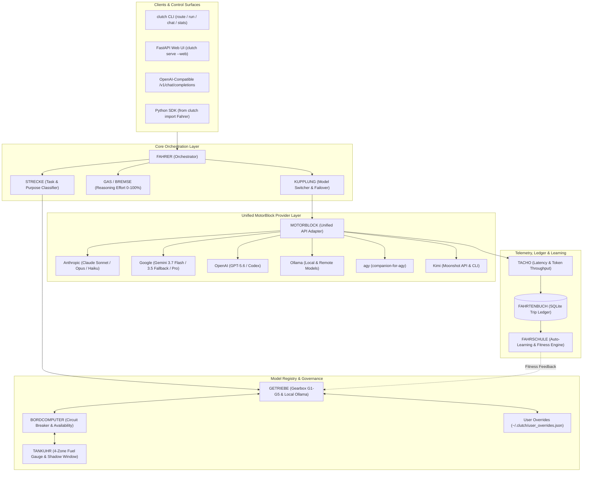
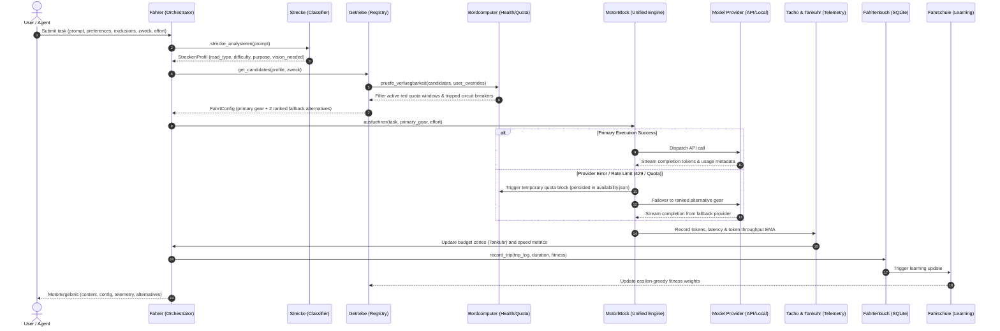

<p align="center">
  
</p>

[English](README.md) · [Deutsch](README_de.md) · [Español](README_es.md) · [简体中文](README_zh-Hans.md) · [日本語](README_ja.md) · [Русский](README_ru.md)

# clutch

> Provider-neutral LLM orchestration engine and model router with auto-learning

[](https://github.com/ellmos-ai/clutch/releases)
[](https://github.com/ellmos-ai/clutch/actions)
[](https://github.com/ellmos-ai/clutch)
[](https://www.python.org/)
[](https://github.com/ellmos-ai/clutch)
[](LICENSE)
[](https://github.com/ellmos-ai/clutch)
[](THIRD_PARTY_LICENSES.md)
[](MARKETING-LOG.txt)
[](SECURITY.md)
[](https://github.com/astral-sh/ruff)
[](SECURITY.md)
[](SECURITY.md)
[](SECURITY.md)
[](https://github.com/ellmos-ai)
[](https://github.com/open-bricks)
[](llms.txt)

**clutch** (German: *Kupplung*) uses an intuitive automotive driving metaphor to intelligently route tasks to optimal LLM models across multiple providers. It analyzes task complexity and purpose, selects the right model gear and reasoning level, tracks budgets with a four-zone fuel gauge, enforces persistent circuit breakers, and learns from experience. Use it as a **library**, a **CLI**, or a **local web app**.

> [!NOTE]
> For AI agents, crawlers, and automated indexers, machine-readable summary metadata and discovery context are available in [llms.txt](llms.txt).

---

## Quick Navigation

1. [Features & Highlights](#1-features)
2. [Architecture & Metaphor Mapping](#2-architecture)
3. [Target Personas & Discoverability](#3-target-personas--discoverability)
4. [Comparative Matrix vs. Alternatives](#4-comparative-matrix-vs-alternatives)
5. [Dual Mermaid Diagrams](#5-dual-mermaid-diagrams)
6. [Governance & Runtime Invariants](#6-governance--runtime-invariants)
7. [Road Types & Task Classification](#7-road-types)
8. [Installation & Requirements](#8-installation)
9. [Quick Start](#9-quick-start)
10. [Command-Line Interface](#10-command-line-interface)
11. [API Keys & Credentials](#11-api-keys--credentials)
12. [Configuration & User Overlays](#12-configuration)
13. [Supported Providers & Model Tiers](#13-supported-providers)
14. [Execution Patterns](#14-execution-patterns)
15. [Ecosystem & Sibling Tools](#15-ecosystem--sibling-tools)
16. [Third-Party Licenses & Transparency](#16-third-party-licenses--transparency)
17. [Security Policy & Liability](#17-security-policy--liability)
18. [Verification & Test Suite](#18-verification--test-suite)

---

<a id="1-features"></a>
<a id="features"></a>
## 1. Features & Highlights

- **Provider-neutral** -- Anthropic (Claude), Google (Gemini), OpenAI (GPT/Codex), Ollama (local & remote), Claude Code, **agy via companion-for-agy**, and **Kimi** (Moonshot API / CLI / Ollama Cloud)
- **Auto-routing** -- analyzes task complexity *and purpose* (coding, vision, research, bulk) and picks the optimal model + reasoning level
- **Purpose & vision aware** -- routes image/document input to vision-capable models; matches tasks to model strengths
- **CLI + Web UI** -- `clutch route/run/chat/models/stats`, plus an optional FastAPI web chat (`clutch serve --web`)
- **Credential store** -- keep API keys in `~/.clutch/credentials.json` (`clutch keys ...`); env vars take precedence
- **Model discovery** -- auto-detect installed Ollama models (local/remote) and OpenAI-compatible `/v1/models`
- **Budget tracking** -- four-zone fuel gauge (green/yellow/orange/red) with daily and monthly limits
- **Learning engine** -- fitness scoring and epsilon-greedy exploration that improves routing over time
- **Execution patterns** -- single tasks, chains (convoy), parallel teams, and swarm processing
- **Persistent availability** -- circuit breakers and quota blocks survive one-shot processes; red Anthropic 5h/7d windows, `notaus`, and provider rate-limit failures are routed around until reset
- **Update-safe user overlay** -- disable models, prefer models/providers, cap model tiers, define aliases, and override model costs in `~/.clutch/user_overrides.json`
- **Evidence-bearing execution selectors** -- resolve runner, family, and exact model bindings without silently substituting models; provider adapters keep five availability stages separate
- **Per-call routing wishes** -- prefer or exclude gears, override purpose/effort, and receive two ranked fallback alternatives
- **Health monitoring** -- persistent circuit breakers, latency tracking, overkill/token-explosion alerts, provider failover
- **SQLite metrics** -- persistent trip log, chat sessions, prompt library, and profiles

---

<a id="2-architecture"></a>
<a id="architecture"></a>
## 2. Architecture & Metaphor Mapping

The entire system follows a **car/driving metaphor**:

```
                    +----------------------------------+
                    |            FAHRER                 |
                    |        (Driver / Orchestrator)    |
                    |     Any LLM: Opus, Gemini, ...   |
                    +--------+----------+--------------+
                             |          |
                +------------+          +-------------+
                |                                     |
        +-------v--------+                   +--------v-------+
        |    STRECKE      |                   |    GETRIEBE    |
        | (Road / Task    |                   | (Gearbox /     |
        |  Analysis)      |                   |  Model Registry|
        +----------------+                   |                |
                                              | G1: Haiku      |
        +----------------+                   | G2: Flash      |
        |   GAS / BREMSE  |                   | G3: Sonnet     |
        | (Throttle/Brake |                   | G4: Gemini Pro |
        |  Reasoning Lvl) |                   | G5: Opus       |
        +----------------+                   | + Ollama local |
                                              +----------------+
        +----------------+
        |    KUPPLUNG     |    +------------+    +-------------+
        | (Clutch / Model |    |   TACHO    |    |  TANKUHR    |
        |  Switching)     |    | (Metrics)  |    | (Budget)    |
        +----------------+    +------------+    +-------------+
```

| Component | Role | Module |
|-----------|------|--------|
| **Fahrer** (Driver) | Orchestrator -- picks model, reasoning, pattern | `fahrer.py` |
| **Strecke** (Road) | Task analysis and classification | `strecke.py` |
| **Getriebe** (Gearbox) | Provider-neutral model registry | `getriebe.py` |
| **Gang** (Gear) | A specific model (G1--G5) | `getriebe.py` |
| **Gas/Bremse** (Throttle/Brake) | Reasoning level (0--100%) | `gas_bremse.py` |
| **Kupplung** (Clutch) | Model switching mechanism | `kupplung.py` |
| **MotorBlock** (Engine) | Unified API call layer | `motorblock.py` |
| **Tacho** (Speedometer) | Metrics collection | `tacho.py` |
| **Tankuhr** (Fuel Gauge) | Budget tracking (4 zones) | `tankuhr.py` |
| **Bordcomputer** (Onboard Computer) | Health monitor, circuit breaker | `bordcomputer.py` |
| **Fahrtenbuch** (Trip Log) | SQLite metrics storage | `fahrtenbuch.py` |
| **Fahrschule** (Driving School) | Learning / evolution engine | `fahrschule.py` |
| **Token-Throughput** (Shadow zone, Stage 1) | Anthropic 5h/7d rate-limit window as a second, display-only zone alongside Tankuhr's USD zones -- see [`docs/STAGED-MIGRATION.md`](docs/STAGED-MIGRATION.md) | `token_throughput.py` |

---

<a id="3-target-personas--discoverability"></a>
<a id="target-personas--discoverability"></a>
## 3. Target Personas & Discoverability

`clutch` is tailored for four technical personas who require fine-grained control over model dispatch, cost predictability, and zero external telemetry:

### `[PERSONA-01]` Autonomous AI Agent Engineers & Multi-Agent Developers
- **Context:** Building multi-agent systems, continuous background workers, and tool-augmented agent loops (e.g. LangGraph, CrewAI, AutoGen, or custom CLI agent wrappers).
- **Pain Point:** Hardcoding expensive frontier models everywhere leads to catastrophic token bills; static provider SDKs crash when rate limits or quota caps hit.
- **How clutch Solves It:** Provides dynamic model hot-swapping across providers (Anthropic, Gemini, OpenAI, Ollama, Kimi), orthogonal reasoning effort adjustment, persistent circuit breakers that survive process restarts, and automatic ranked fallback chains.

### `[PERSONA-02]` Multi-Host & Edge Infrastructure Systems Engineers
- **Context:** Managing mixed computing topologies spanning powerful local GPU workstations, laptops, edge nodes, and cloud API endpoints.
- **Pain Point:** Uneven hardware availability across machines makes static endpoint configurations brittle; cloud proxies introduce unwanted latency and central points of failure.
- **How clutch Solves It:** Auto-discovers local and remote Ollama instances alongside cloud providers, resolves execution selectors without silent substitutions, and isolates per-host state cleanly.

### `[PERSONA-03]` Solo Developers & Tool Builders
- **Context:** Developing indie software, developer utilities, and personal CLI tools that need LLM intelligence without complex enterprise gateways.
- **Pain Point:** Setting up complex proxy daemons (LiteLLM, Portkey) or Docker stacks is overkill; ad-hoc Python wrappers lack metrics and budget safeguards.
- **How clutch Solves It:** Drop-in library (`from clutch import Fahrer`) and single-command CLI (`clutch run`) with an intuitive car metaphor, 4-zone budget Tankuhr, SQLite audit log, and zero background daemon requirement.

### `[PERSONA-04]` Privacy & Compliance Officers
- **Context:** Ensuring corporate data protection, HIPAA/GDPR compliance, and IP protection in AI-assisted developer workflows.
- **Pain Point:** SaaS model gateways intercept and log sensitive prompts; unclear licensing or elevated daemon privileges introduce audit liabilities.
- **How clutch Solves It:** 100% local-first zero-egress architecture with network traffic strictly confined to user-configured endpoints, unprivileged user-mode execution (`RunAsInvoker`), permissive MIT licensing, and transparent SPDX license inventory.

### High-Intent SEO & AI Discoverability Keywords
To facilitate discoverability across developer directories, package managers, and semantic search engines:
- `provider-neutral LLM orchestration engine and model router` -- Open-source Python routing library across Anthropic, Gemini, OpenAI, Ollama, and Kimi.
- `local-first zero-egress LLM budget tracking fuel gauge` -- 4-zone financial budget tracker with shadow token throughput window.
- `automotive metaphor LLM routing Anthropic Gemini OpenAI Ollama Kimi` -- Intuitive Fahrer, Strecke, Getriebe, Gas/Bremse, Kupplung model dispatch.
- `persistent circuit breaker quota failover multi-agent system` -- Process-surviving availability blocks preventing quota loops.
- `adaptive reasoning effort throttle brake model switching` -- Orthogonal reasoning effort levels decoupled from monolithic model selection.
- `evidence-bearing execution selector model resolution` -- Strict five-stage proof of provider availability without silent model substitution.
- `unprivileged user-mode LLM router RunAsInvoker MIT license` -- Safe unprivileged user-space operation with 100% permissive software inventory.

---

<a id="4-comparative-matrix-vs-alternatives"></a>
<a id="comparative-matrix-vs-alternatives"></a>
## 4. Comparative Matrix vs. Alternatives

The following matrix compares `clutch` against existing model routing and gateway paradigms across 10 technical dimensions directly mapped to our governance invariants:

| Technical Dimension | Governance Invariant | clutch | Traditional Single-Provider SDKs | Cloud Model Gateways (LiteLLM / OpenRouter) | Agent Framework Routers (CrewAI / AutoGen) | Ad-Hoc Script & Prompt Routers |
|---|:---:|:---:|:---:|:---:|:---:|
| **1. Multi-Provider Neutrality** | `INV-LOCAL-01` | **Full Hot-Swap (Anthropic, Gemini, OpenAI, Ollama, Kimi)** | None (Single vendor lock-in) | High (Multi-provider API wrapper) | Medium (Framework-specific adapters) | Low (Manual boilerplate per API) |
| **2. Offline-First & Zero Egress** | `INV-LOCAL-02` | **100% Local (Local disk, zero telemetry)** | High (Direct provider calls) | Low (Centralized cloud telemetry / SaaS) | Low (Often bundles cloud telemetry) | High (Custom code) |
| **3. Non-Elevation User Mode** | `INV-UNPRIV-03` | **Strict RunAsInvoker (User-mode, no daemon)** | High (User-space library) | Often requires background daemon / Docker | High (User-space library) | High (User-space script) |
| **4. Persistent Circuit Breakers** | `INV-CIRCUIT-04` | **Persistent `availability.json` (Survives restarts)** | None (Fails directly on 429) | Ephemeral / In-Memory (Lost on restart) | Ephemeral (Lost on workflow exit) | None (Script crashes or loops) |
| **5. Update-Safe User Overlays** | `INV-OVERLAY-05` | **Persistent `user_overrides.json` & Aliases** | None (Code edits required) | Basic (Config file / DB) | Code configuration | Hardcoded variables |
| **6. Ranked Dual Fallbacks** | `INV-FALLBACK-06` | **Deterministic Primary + 2 Ranked Alternatives** | None | Basic (Linear retry list) | Partial (Catch-all exception handling) | None (Hard failover) |
| **7. 4-Zone Budget & Fuel Gauge** | `INV-BUDGET-07` | **Tankuhr (Green/Yellow/Orange/Red + Throughput)** | None (External billing dashboard only) | Basic (Spend limits / balance check) | None (No native financial guardrails) | None (Uncontrolled API spend) |
| **8. Purpose & Vision Alignment** | `INV-PURPOSE-08` | **Automatic Modality Matching (Vision/Code/Fast)** | Manual | Manual model selection | Partial (Agent role prompts) | None |
| **9. Transactional Audit Ledger** | `INV-LEDGER-09` | **ACID SQLite Fahrtenbuch & Chat History** | None (Stateless) | Cloud logging dashboard | Ephemeral in-memory | None / Plain text files |
| **10. Multi-OS Parity & Security SLA** | `INV-SLA-10` | **48h SLA / Multi-OS CI / Zero-Copyleft MIT** | Enterprise vendor terms | Mixed / Closed SaaS terms | Variable open-source | None (Unmaintained scripts) |

---

<a id="5-dual-mermaid-diagrams"></a>
<a id="dual-mermaid-diagrams"></a>
## 5. Dual Mermaid Diagrams

### 1. System Architecture Topology


```mermaid
flowchart TD
    subgraph CLIENTS["Clients & Control Surfaces"]
        CLI["clutch CLI (route / run / chat / stats)"]
        Web["FastAPI Web UI (clutch serve --web)"]
        API["OpenAI-Compatible /v1/chat/completions"]
        Lib["Python SDK (from clutch import Fahrer)"]
    end

    subgraph ORCHESTRATION["Core Orchestration Layer"]
        Fahrer["FAHRER (Orchestrator)"]
        Strecke["STRECKE (Task & Purpose Classifier)"]
        GasBremse["GAS / BREMSE (Reasoning Effort 0-100%)"]
        Kupplung["KUPPLUNG (Model Switcher & Failover)"]
    end

    subgraph REGISTRY["Model Registry & Governance"]
        Getriebe["GETRIEBE (Gearbox G1-G5 & Local Ollama)"]
        Bordcomputer["BORDCOMPUTER (Circuit Breaker & Availability)"]
        Tankuhr["TANKUHR (4-Zone Fuel Gauge & Shadow Window)"]
        UserOverrides["User Overrides (~/.clutch/user_overrides.json)"]
    end

    subgraph ENGINES["Unified MotorBlock Provider Layer"]
        MotorBlock["MOTORBLOCK (Unified API Adapter)"]
        Anthropic["Anthropic (Claude Sonnet / Opus / Haiku)"]
        Gemini["Google (Gemini 3.7 Flash / 3.5 Fallback / Pro)"]
        OpenAI["OpenAI (GPT-5.6 / Codex)"]
        Ollama["Ollama (Local & Remote Models)"]
        Agy["agy (companion-for-agy)"]
        Kimi["Kimi (Moonshot API & CLI)"]
    end

    subgraph TELEMETRY["Telemetry, Ledger & Learning"]
        Tacho["TACHO (Latency & Token Throughput)"]
        Fahrtenbuch[("FAHRTENBUCH (SQLite Trip Ledger)")]
        Fahrschule["FAHRSCHULE (Auto-Learning & Fitness Engine)"]
    end

    CLIENTS --> Fahrer
    Fahrer --> Strecke
    Strecke --> Getriebe
    Fahrer --> GasBremse
    Fahrer --> Kupplung
    Getriebe <--> Bordcomputer
    Getriebe <--> UserOverrides
    Bordcomputer <--> Tankuhr
    Kupplung --> MotorBlock
    MotorBlock --> Anthropic
    MotorBlock --> Gemini
    MotorBlock --> OpenAI
    MotorBlock --> Ollama
    MotorBlock --> Agy
    MotorBlock --> Kimi
    MotorBlock --> Tacho
    Tacho --> Fahrtenbuch
    Fahrtenbuch --> Fahrschule
    Fahrschule -. Fitness Feedback .-> Getriebe
```

### 2. End-to-End Task & Routing Lifecycle


```mermaid
sequenceDiagram
    autonumber
    actor User as User / Agent
    participant Fahrer as Fahrer (Orchestrator)
    participant Strecke as Strecke (Classifier)
    participant Getriebe as Getriebe (Registry)
    participant Bord as Bordcomputer (Health/Quota)
    participant Motor as MotorBlock (Unified Engine)
    participant Provider as Model Provider (API/Local)
    participant Tacho as Tacho & Tankuhr (Telemetry)
    participant Ledger as Fahrtenbuch (SQLite)
    participant School as Fahrschule (Learning)

    User->>Fahrer: Submit task (prompt, preferences, exclusions, zweck, effort)
    Fahrer->>Strecke: strecke_analysieren(prompt)
    Strecke-->>Fahrer: StreckenProfil (road_type, difficulty, purpose, vision_needed)
    Fahrer->>Getriebe: get_candidates(profile, zweck)
    Getriebe->>Bord: pruefe_verfuegbarkeit(candidates, user_overrides)
    Bord-->>Getriebe: Filter active red quota windows & tripped circuit breakers
    Getriebe-->>Fahrer: FahrtConfig (primary gear + 2 ranked fallback alternatives)
    Fahrer->>Motor: ausfuehren(task, primary_gear, effort)
    alt Primary Execution Success
        Motor->>Provider: Dispatch API call
        Provider-->>Motor: Stream completion tokens & usage metadata
    else Provider Error / Rate Limit (429 / Quota)
        Motor->>Bord: Trigger temporary quota block (persisted in availability.json)
        Motor->>Provider: Failover to ranked alternative gear
        Provider-->>Motor: Stream completion from fallback provider
    end
    Motor->>Tacho: Record tokens, latency & token throughput EMA
    Tacho->>Fahrer: Update budget zones (Tankuhr) and speed metrics
    Fahrer->>Ledger: record_trip(trip_log, duration, fitness)
    Ledger->>School: Trigger learning update
    School-->>Getriebe: Update epsilon-greedy fitness weights
    Fahrer-->>User: MotorErgebnis (content, config, telemetry, alternatives)
```

---

<a id="6-governance--runtime-invariants"></a>
<a id="governance--runtime-invariants"></a>
## 6. Governance & Runtime Invariants

| # | Invariant | Scope | Operational Guarantee |
|---|-----------|-------|-----------------------|
| **1** | **Provider Agnosticism & Zero Lock-in** | Engine | No mandatory vendor dependency; seamless hot-swapping between Anthropic, Google Gemini, OpenAI, Ollama, and Kimi. |
| **2** | **100% Local-First & Zero Egress** | Network | No analytics, tracking, or telemetry egress; network calls connect strictly to user-configured LLM provider endpoints. |
| **3** | **Non-Elevation User Mode** | Process | All CLI commands, background processes, and FastAPI web servers execute within unprivileged user-space permissions. |
| **4** | **Fail-Closed Circuit Breaker** | Reliability | Quota blocks, red windows, and API failures trigger persistent circuit breakers in `~/.clutch/availability.json` rather than looping. |
| **5** | **Update-Safe User Overlays** | Configuration | User preferences, model exclusions, aliases, and cost overrides live in `~/.clutch/user_overrides.json` and persist across package updates. |
| **6** | **Dual-Alternative Ranked Fallbacks** | Routing | Every routing resolution produces a primary gear plus two ranked alternative fallbacks (`alternativen`). |
| **7** | **Two-Dimensional Telemetry** | Budget | Combines financial USD consumption zones (`Tankuhr`) with real-time token throughput burn rates (`token_throughput.py`). |
| **8** | **Purpose & Vision Alignment** | Classification | Multimodal and vision inputs are strictly routed to vision-capable models; code tasks match specialized coding gears. |
| **9** | **Transactional SQLite Audit Ledger** | Persistence | All trips, execution records, chat sessions, and prompt library entries are safely stored in local SQLite databases with ACID guarantees. |
| **10** | **Cross-Platform Multi-OS Parity** | Platform | Identical behavior, CLI ergonomics, test coverage, and routing semantics across Linux, Windows, and macOS. |

---

<a id="7-road-types"></a>
<a id="road-types"></a>
## 7. Road Types & Task Classification

| Road | Difficulty | Default Gear | Throttle | Pattern |
|------|-----------|-------------|----------|---------|
| Feldweg (Dirt road) | Trivial | Haiku (G1) | 30% | Single |
| Landstrasse (Country road) | Standard | Sonnet (G3) | 50% | Single |
| Bundesstrasse (Highway) | Bugfix | Sonnet (G3) | 70% | Single |
| Autobahn (Motorway) | Architecture | Opus (G5) | 90% | Single |
| Rallye (Rally) | Bulk ops | Haiku (G1) | 30% | Swarm |
| Konvoi (Convoy) | Pipeline | Sonnet (G3) | 50% | Chain |
| Teamfahrt (Team drive) | Multi-file | Sonnet (G3) | 50% | Team |
| Langstrecke (Long distance) | Complex | Opus (G5) | 90% | Hybrid |

---

<a id="8-installation"></a>
<a id="installation"></a>
## 8. Installation & Requirements

```bash
git clone https://github.com/ellmos-ai/clutch.git
cd clutch
pip install -e .
```

### Optional Web UI
```bash
pip install -e .[web]
```

### Requirements
- Python 3.10+
- API keys for your desired providers (set as environment variables or via `clutch keys set`):
  - `ANTHROPIC_API_KEY` for Claude models
  - `GOOGLE_API_KEY` for Gemini models
  - `OPENAI_API_KEY` for GPT and Codex models
  - `MOONSHOT_API_KEY` for Kimi API models
  - Ollama running locally for local models

---

<a id="9-quick-start"></a>
<a id="quick-start"></a>
## 9. Quick Start

```python
from clutch import Fahrer

# Create a driver (uses all configured providers)
fahrer = Fahrer()

# Describe your task -- the driver handles everything
result = fahrer.fahren(
    "Fix the authentication bug in the login module",
    handler=my_handler,
)

# Inspect what was chosen
print(result.config.gang.name)       # "claude-sonnet"
print(result.config.gang.provider)   # "anthropic"
print(result.config.gas.wert)        # 0.7

# Dashboard
status = fahrer.status()
print(status["tankuhr"]["zone"])     # "green"
print(status["getriebe"])            # "Getriebe[haiku(G1), flash(G2), ...]"

# Learn from past runs
fahrer.trainieren()
```

---

<a id="10-command-line-interface"></a>
<a id="command-line-interface"></a>
## 10. Command-Line Interface

After `pip install -e .` the `clutch` command is available:

```bash
clutch route "Fix the auth bug"      # show the routing decision (dry-run, no LLM call)
clutch route "..." --prefer codex --exclude claude-sonnet --zweck coding --effort high
clutch "Explain quantum computing"    # one-shot: route + execute, print the answer
clutch run "..." --json               # machine-readable output (for other agents)
clutch chat                           # interactive REPL
clutch models [--status] [--json]     # models plus optional availability/reset reason
clutch models disable claude-sonnet   # persistent, update-safe user override
clutch models enable claude-sonnet
clutch resolve gpt5 --runner codex --json  # resolve only; never executes a model
clutch config prefer openai           # prefer a model or provider persistently
clutch stats                          # usage / budget / health dashboard
clutch config <key> [value]           # read/set CLI settings
clutch keys set MOONSHOT_API_KEY      # store an API key (hidden input; values never shown)
clutch keys list                      # list stored key names (not values)
clutch serve --web                    # start the web UI (needs: pip install clutch[web])
```

Three usage modes: **console** (humans), **web UI** (humans, graphical), and **CLI/API**
(other LLMs/agents routing tasks via `--json` or the OpenAI-compatible web endpoint).

---

<a id="11-api-keys--credentials"></a>
<a id="api-keys--credentials"></a>
## 11. API Keys & Credentials

clutch resolves keys in this order (first non-empty wins):

1. Environment variable (e.g. `MOONSHOT_API_KEY`) -- preferred for CI/servers
2. clutch store `~/.clutch/credentials.json` (via `clutch keys set`, file mode 0600)
3. `~/.credentials/<name>` files (interop with sibling tools)

Values are never printed, logged, or committed.

---

<a id="12-configuration"></a>
<a id="configuration"></a>
## 12. Configuration & User Overlays

Default config lives in `clutch/config/` so editable installs and wheels use the
same bundled routing defaults. Pass a custom `base_dir` with its own `config/`
folder to `Fahrer` if you want project-specific overrides.

| File | Purpose |
|------|---------|
| `kupplung.json` | Global settings (driver defaults, swarm limits, budget) |
| `getriebe.json` | All gears + provider mappings |
| `strecken.json` | Road type to gear/throttle/effort mapping |
| `fitness_criteria.json` | Learning engine thresholds |

Bundled files remain immutable defaults. User choices are layered over them
from `~/.clutch/user_overrides.json` with these fields:

```json
{
  "disabled_models": ["claude-sonnet"],
  "preferred_models": ["openai-codex"],
  "preferred_providers": ["openai"],
  "model_max_gang": {"openai-codex": 4},
  "aliases": {"codex": "openai-codex"},
  "model_cost_override": {
    "ollama-kimi-k2": {"kosten_input_1k": 0.001, "kosten_output_1k": 0.004}
  }
}
```

`~/.clutch/availability.json` is runtime-owned state. It persists model circuit
states and provider quota blocks with `until`/`resets_at`; every
`Bordcomputer.pruefe()` reloads it, so separate CLI processes share the same
availability decision. Missing or stale token-budget input never creates a new
block, while a previously evidenced red block remains active until its reset.

### Execution selectors and provider evidence

`resolve_execution_selector()` resolves runner profiles (`claude`, `codex`,
`agy`, `clutch`, `ollama`, `kimi`), `self`, families such as `gpt5`, and exact
registry names or model IDs. Exact selectors are never substituted. The JSON
result separates `resolved` (the selector exists) from `claimable` (all required
evidence exists) and includes a deterministic registry fingerprint.

Claimability requires five independent stages to be true:
`provider_documented`, `provider_api_listed`, `account_accessible`,
`runner_compatible`, and `host_ready`. Bundled catalog data deliberately does
not infer account access or host readiness, so it fails closed until a caller
applies a proven `ProviderCatalogSnapshot`.

Provider I/O remains outside the core package. Injected `ProviderCatalogAdapter`
implementations return validated snapshots; `refresh_provider_catalog()` reports
their diff and retains the last proven snapshot on failure. Applying a snapshot
can enrich existing curated gears but never adds a provider-discovered model.

### Per-call routing wishes

The library accepts the same routing wishes as the CLI:

```python
profile = fahrer.strecke_analysieren("Implement the parser")
config = fahrer.kuppeln(
    profile,
    zweck="coding",
    effort_override="high",
    ausschluss=["claude-sonnet"],
    praeferenz=["codex", "openai"],
)
print(config.gang.name)
print(config.alternativen)  # two ranked fallback gears
```

Hard constraints (disabled/unavailable/excluded gears, budget, trust, and
required vision capability) are applied before preferences. Route JSON always
contains `alternativen`.

### Reasoning Effort

Model choice and reasoning effort are orthogonal: clutch decides **which
model** (gear) and records **how deeply** a compatible agent should work in the
optional `effort` field. Road classes in `strecken.json` can use:

- `high` for routine, bounded work
- `xhigh` as the normal thorough session level
- `max-delegate` for a transparent, targeted max worker on the hardest single
  step; it does not enable a persistent max mode

Callers may override the recommendation for one invocation with
`kontext={"effort": "high"}`. `ultracode` is intentionally not an effort
value: it describes breadth (team/swarm fan-out), not deeper reasoning, and
expensive fan-out still needs explicit confirmation. Split long compute into
observable steps; when one step is expected to take about 10--15 minutes or
more, route that step to the Mac Studio compute path.

### Budget Zones

| Zone | Usage | Allowed Gears |
|------|-------|--------------|
| Green | 0--30% | All (G1--G5) |
| Yellow | 30--60% | G1--G3 |
| Orange | 60--80% | G1--G2 only |
| Red | 80--100% | None (budget exhausted) |

`clutch/config/fitness_criteria.json` is the single runtime source for these
limits. Both the onboard computer and the clutch read the same policy; a red
zone stops routing before an LLM is selected.

---

<a id="13-supported-providers"></a>
<a id="supported-providers"></a>
## 13. Supported Providers & Model Tiers

| Provider | Models | Local |
|----------|--------|-------|
| **Anthropic** | Claude Fable 5, Haiku, Sonnet, Opus | No |
| **Google** | Gemini 3.7 Flash (preferred), Gemini 3.5 Flash fallback, Gemini 3.1 Pro Preview | No |
| **OpenAI** | GPT-5.6 Luna/Terra/Sol via Responses API, GPT-5.3-Codex | No |
| **Ollama** | Qwen, Mistral, and more (local & remote); Kimi K3, GLM 5.3, K2.7 Code via Ollama Cloud | Yes / Cloud |
| **Claude Code** | Via subprocess (CLI session) | Yes |
| **agy** | Live-discovered Gemini, Claude and GPT-OSS catalog via `companion-for-agy` | CLI session |
| **Kimi (Moonshot)** | `kimi-k2.7-code`, `kimi-k2.6` via OpenAI-compatible API; `kimi-cli`/`kimi-code` CLI; Ollama Cloud | API / CLI |
| **OpenAI-compatible** | Any `/v1/chat/completions` endpoint (set `base_url`) | No |

### GPT-5.6 Cost and Empirical Routing

GPT-5.6 pricing is versioned in the model catalog and shared by runtime telemetry, Tankuhr, CLI/API JSON, and stats. The calculator distinguishes observed, assumed, and unknown usage; missing provider usage is unmetered (`cost_usd=null`), not zero. It accounts for cached input, cache writes, the >272k long-context multipliers, Standard/Fast service, tool fees, and reasoning tokens exactly once.

```bash
clutch cost --model gpt-5.6-terra --input 100000 --cached-input 20000 --output 10000 --json
```

All three GPT-5.6 models expose efforts `none`, `low`, `medium`, `high`, `xhigh`, and `max`. Higher effort allows more reasoning but does not guarantee monotonically more visible tokens or universally better outcomes. Routing therefore applies per-task quality/latency gates and expected cost per successful task on a Pareto frontier; without enough labelled observations it reports a role-based cold start rather than fabricating scores.

See [GPT-5.6 cost and routing](docs/GPT56_COST_ROUTING.md), the [example input](docs/gpt56_cost_example.json), and the generated [price-facts chart](docs/gpt56_price_facts.svg).

---

<a id="14-execution-patterns"></a>
<a id="execution-patterns"></a>
## 14. Execution Patterns

- **Single** -- one model, one task
- **Convoy (Kolonne)** -- sequential chain, output N feeds input N+1
- **Team** -- parallel specialized workers, results merged
- **Swarm** -- massively parallel micro-tasks (e.g., 20x Haiku), then aggregation

---

## Project Structure

```
clutch/
+-- clutch/
|   +-- __init__.py
|   +-- fahrer.py          # Orchestrator
|   +-- strecke.py         # Task analysis
|   +-- getriebe.py        # Model registry
|   +-- kupplung.py        # Model switching
|   +-- motorblock.py      # Unified API layer
|   +-- gas_bremse.py      # Reasoning level
|   +-- fahrtenbuch.py     # SQLite metrics
|   +-- bordcomputer.py    # Health monitor
|   +-- tankuhr.py         # Budget tracking
|   +-- tacho.py           # Metrics
|   +-- fahrschule.py      # Learning engine
|   +-- token_throughput.py# Anthropic 5h/7d throughput
|   +-- patterns/
|       +-- kolonne.py     # Chain pattern
|       +-- team.py        # Parallel pattern
|       +-- schwarm.py     # Swarm pattern
|       +-- hybrid.py      # Hybrid pattern
|   +-- config/
|       +-- kupplung.json
|       +-- getriebe.json
|       +-- strecken.json
|       +-- fitness_criteria.json
+-- tests/
|   +-- test_clutch.py
|   +-- test_learning.py
|   +-- test_patterns.py
|   +-- test_route.py
|   +-- test_metadata.py   # Automated parity contract tests
+-- data/                  # Runtime data (not tracked)
```

---

<a id="15-ecosystem--sibling-tools"></a>
<a id="ecosystem--sibling-tools"></a>
## 15. Ecosystem & Sibling Tools

Part of the [ellmos-ai](https://github.com/ellmos-ai) multi-agent infrastructure and the overarching [open-bricks](https://github.com/open-bricks) open-source software ecosystem:

| Tool | Organization | Description |
|------|--------------|-------------|
| [coma](https://github.com/ellmos-ai/coma) | ellmos-ai | Single-binary multi-agent orchestrator & execution coordinator |
| [swarm-ai](https://github.com/ellmos-ai/swarm-ai) | ellmos-ai | Swarm intelligence and autonomous agent consensus engine |
| [system-explorer](https://github.com/ellmos-ai/system-explorer) | ellmos-ai | Local system discovery and hardware resource monitor |
| [policy-registry](https://github.com/ellmos-ai/policy-registry) | ellmos-ai | Unified agent permission and policy management engine |
| [sqlite-transit-sync](https://github.com/ellmos-ai/sqlite-transit-sync) | ellmos-ai | Multi-agent state synchronization via SQLite WAL journals |
| [workflowhooker](https://github.com/ellmos-ai/workflowhooker) | ellmos-ai | Event hooks and agent workflow automation triggers |
| [memoryhooker](https://github.com/ellmos-ai/memoryhooker) | ellmos-ai | Transparent SQLite/FTS5 working memory capture for agents |
| [agent-ops-stack](https://github.com/ellmos-ai/agent-ops-stack) | ellmos-ai | Composed operational sidecar stack for autonomous agents |
| [convergence-reconciler](https://github.com/ellmos-ai/convergence-reconciler) | ellmos-ai | Cross-model convergence validation & consensus engine |
| [DevCenter](https://github.com/dev-bricks/DevCenter) | dev-bricks | Developer control plane, repository dashboard & environment manager |
| [CodeBox](https://github.com/dev-bricks/CodeBox) | dev-bricks | Polyglot code snippet manager & developer workbench |
| [open-bricks](https://github.com/open-bricks) | open-bricks | Umbrella open-source organization for autonomous tools & infrastructure |

---

<a id="16-third-party-licenses--transparency"></a>
<a id="third-party-licenses--transparency"></a>
## 16. Third-Party Licenses & Transparency

`clutch` is committed to absolute software transparency, licensing compliance, and supply chain integrity:

- **Complete SPDX Software Inventory:** Every mandatory runtime dependency (`anthropic`, `google-genai`, `requests`), optional web dependency (`fastapi`, `uvicorn`, `python-multipart`), and development tool (`pytest`, `ruff`) is documented with exact license identifiers in [THIRD_PARTY_LICENSES.md](THIRD_PARTY_LICENSES.md).
- **Zero-Copyleft Guarantee:** 100% of all dependencies use permissive, business-friendly open-source licenses (MIT, Apache-2.0, BSD-3-Clause, PSF). There are zero GPL, AGPL, or viral copyleft components.
- **Unprivileged User Mode (`RunAsInvoker`):** All CLI tools, web interfaces, and local databases execute with standard user permissions without administrative elevation.
- **Runtime Governance Invariants:** Formal confirmation of the 10 Governance & Runtime Invariants (`INV-LOCAL-01` through `INV-SLA-10`).

For full dependency tables, license texts, and attribution notices, refer to [THIRD_PARTY_LICENSES.md](THIRD_PARTY_LICENSES.md).

---

<a id="17-security-policy--liability"></a>
<a id="security-policy--liability"></a>
## 17. Security Policy & Liability

See [SECURITY.md](SECURITY.md) for supported versions, response SLAs, and vulnerability reporting procedures.

### Haftungsausschluss / Liability Disclaimer

Dieses Projekt ist eine **unentgeltliche Open-Source-Schenkung** im Sinne der §§ 516 ff. BGB. Die Haftung des Urhebers ist gemäß **§ 521 BGB** auf **Vorsatz und grobe Fahrlässigkeit** beschränkt. Ergänzend gelten die Haftungsausschlüsse der MIT-Lizenz.

Nutzung auf eigenes Risiko. Keine Wartungszusage, keine Verfügbarkeitsgarantie, keine Gewähr für Fehlerfreiheit oder Eignung für einen bestimmten Zweck.

This project is an unpaid open-source donation. Liability is limited to intent and gross negligence (§ 521 German Civil Code). Use at your own risk. No warranty, no maintenance guarantee, no fitness-for-purpose assumed.

---

<a id="18-verification--test-suite"></a>
<a id="verification--test-suite"></a>
## 18. Verification & Test Suite

`clutch` maintains an exhaustive automated test suite with 100% pass rate across Linux, Windows, and macOS:

```bash
# Run unit, contract, and regression tests
python -m pytest -ra -v

# Run fast silent check
pytest -q

# Run code style and linting
ruff check .

# Verify bytecode compilation
python -m compileall clutch tests
```

The test suite validates:
- Core routing mechanics, task classification, and purpose mapping (`test_route.py`, `test_clutch.py`)
- Automotive execution patterns: convoy, team, swarm, and hybrid (`test_patterns.py`)
- Learning engine, epsilon-greedy exploration, and fitness feedback (`test_learning.py`)
- Provider engines and model catalog parity (`test_kimi_motoren.py`, `test_motorblock.py`)
- Metadata contracts, bilingual documentation parity, CI timeouts, gitignore hygiene, and licensing integrity (`test_metadata.py`)

---

## Contributing

See [CONTRIBUTING.md](CONTRIBUTING.md) for guidelines.
For the German automotive API terms, see [GLOSSARY.md](GLOSSARY.md).
