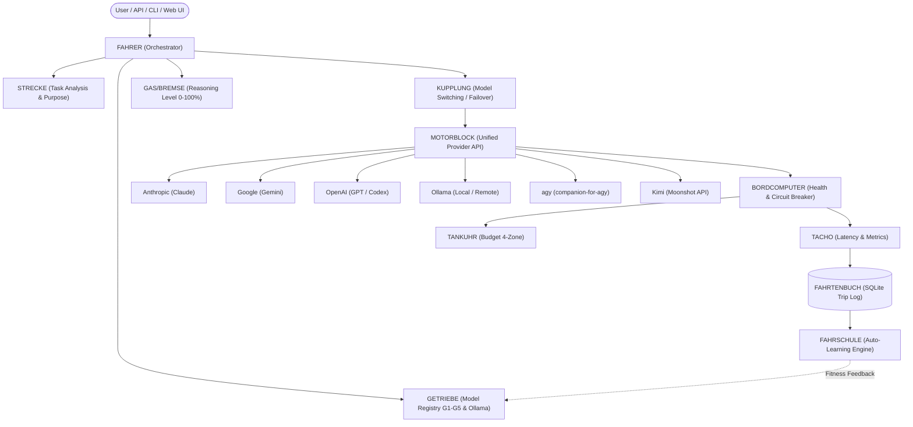

<p align="center">
  
</p>

[English](README.md) · [Deutsch](README_de.md) · [Español](README_es.md) · [简体中文](README_zh-Hans.md) · [日本語](README_ja.md) · [Русский](README_ru.md)

# clutch

> Provider-neutral LLM orchestration engine with auto-learning


**clutch** (German: *Kupplung*) uses a driving metaphor to intelligently route tasks to optimal LLM models across multiple providers. It analyzes task complexity and purpose, selects the right model and reasoning level, tracks budgets, and learns from experience. Use it as a **library**, a **CLI**, or a **local web app**.

> [!NOTE]
> For AI agents and automated indexers, machine-readable summary metadata and discovery context are available in [llms.txt](llms.txt).

## Features

- **Provider-neutral** -- Anthropic (Claude), Google (Gemini), OpenAI (GPT/Codex), Ollama (local & remote), Claude Code, **agy via companion-for-agy**, and **Kimi** (Moonshot API / CLI / Ollama Cloud)
- **Auto-routing** -- analyzes task complexity *and purpose* (coding, vision, research, bulk) and picks the optimal model + reasoning level
- **Purpose & vision aware** -- routes image/document input to vision-capable models; matches tasks to model strengths
- **CLI + Web UI** -- `clutch route/run/chat/models/stats`, plus an optional FastAPI web chat (`clutch serve --web`)
- **Credential store** -- keep API keys in `~/.clutch/credentials.json` (`clutch keys ...`); env vars take precedence
- **Model discovery** -- auto-detect installed Ollama models (local/remote) and OpenAI-compatible `/v1/models`
- **Budget tracking** -- four-zone fuel gauge (green/yellow/orange/red) with daily and monthly limits
- **Learning engine** -- fitness scoring and epsilon-greedy exploration that improves routing over time
- **Execution patterns** -- single tasks, chains (convoy), parallel teams, and swarm processing
- **Health monitoring** -- circuit breakers, latency tracking, overkill/token-explosion alerts, provider failover
- **SQLite metrics** -- persistent trip log, chat sessions, prompt library, and profiles

## Architecture

The entire system follows a **car/driving metaphor**:


```mermaid
graph TD
    User([User / API / CLI / Web UI]) --> Fahrer["FAHRER (Orchestrator)"]
    Fahrer --> Strecke["STRECKE (Task Analysis & Purpose)"]
    Fahrer --> Getriebe["GETRIEBE (Model Registry G1-G5 & Ollama)"]
    Fahrer --> GasBremse["GAS/BREMSE (Reasoning Level 0-100%)"]
    Fahrer --> Kupplung["KUPPLUNG (Model Switching / Failover)"]
    Kupplung --> MotorBlock["MOTORBLOCK (Unified Provider API)"]
    MotorBlock --> Anthropic["Anthropic (Claude)"]
    MotorBlock --> Gemini["Google (Gemini)"]
    MotorBlock --> OpenAI["OpenAI (GPT / Codex)"]
    MotorBlock --> Ollama["Ollama (Local / Remote)"]
    MotorBlock --> Agy["agy (companion-for-agy)"]
    MotorBlock --> Kimi["Kimi (Moonshot API)"]
    MotorBlock --> Bordcomputer["BORDCOMPUTER (Health & Circuit Breaker)"]
    Bordcomputer --> Tankuhr["TANKUHR (Budget 4-Zone)"]
    Bordcomputer --> Tacho["TACHO (Latency & Metrics)"]
    Tacho --> Fahrtenbuch[("FAHRTENBUCH (SQLite Trip Log)")]
    Fahrtenbuch --> Fahrschule["FAHRSCHULE (Auto-Learning Engine)"]
    Fahrschule -. Fitness Feedback .-> Getriebe
```

```
                    +----------------------------------+
                    |            FAHRER                 |
                    |        (Driver / Orchestrator)    |
                    |     Any LLM: Opus, Gemini, ...   |
                    +--------+----------+--------------+
                             |          |
                +------------+          +-------------+
                |                                     |
        +-------v--------+                   +--------v-------+
        |    STRECKE      |                   |    GETRIEBE    |
        | (Road / Task    |                   | (Gearbox /     |
        |  Analysis)      |                   |  Model Registry|
        +----------------+                   |                |
                                              | G1: Haiku      |
        +----------------+                   | G2: Flash      |
        |   GAS / BREMSE  |                   | G3: Sonnet     |
        | (Throttle/Brake |                   | G4: Gemini Pro |
        |  Reasoning Lvl) |                   | G5: Opus       |
        +----------------+                   | + Ollama local |
                                              +----------------+
        +----------------+
        |    KUPPLUNG     |    +------------+    +-------------+
        | (Clutch / Model |    |   TACHO    |    |  TANKUHR    |
        |  Switching)     |    | (Metrics)  |    | (Budget)    |
        +----------------+    +------------+    +-------------+
```

| Component | Role | Module |
|-----------|------|--------|
| **Fahrer** (Driver) | Orchestrator -- picks model, reasoning, pattern | `fahrer.py` |
| **Strecke** (Road) | Task analysis and classification | `strecke.py` |
| **Getriebe** (Gearbox) | Provider-neutral model registry | `getriebe.py` |
| **Gang** (Gear) | A specific model (G1--G5) | `getriebe.py` |
| **Gas/Bremse** (Throttle/Brake) | Reasoning level (0--100%) | `gas_bremse.py` |
| **Kupplung** (Clutch) | Model switching mechanism | `kupplung.py` |
| **MotorBlock** (Engine) | Unified API call layer | `motorblock.py` |
| **Tacho** (Speedometer) | Metrics collection | `tacho.py` |
| **Tankuhr** (Fuel Gauge) | Budget tracking (4 zones) | `tankuhr.py` |
| **Bordcomputer** (Onboard Computer) | Health monitor, circuit breaker | `bordcomputer.py` |
| **Fahrtenbuch** (Trip Log) | SQLite metrics storage | `fahrtenbuch.py` |
| **Fahrschule** (Driving School) | Learning / evolution engine | `fahrschule.py` |

## Road Types

| Road | Difficulty | Default Gear | Throttle | Pattern |
|------|-----------|-------------|----------|---------|
| Feldweg (Dirt road) | Trivial | Haiku (G1) | 30% | Single |
| Landstrasse (Country road) | Standard | Sonnet (G3) | 50% | Single |
| Bundesstrasse (Highway) | Bugfix | Sonnet (G3) | 70% | Single |
| Autobahn (Motorway) | Architecture | Opus (G5) | 90% | Single |
| Rallye (Rally) | Bulk ops | Haiku (G1) | 30% | Swarm |
| Konvoi (Convoy) | Pipeline | Sonnet (G3) | 50% | Chain |
| Teamfahrt (Team drive) | Multi-file | Sonnet (G3) | 50% | Team |
| Langstrecke (Long distance) | Complex | Opus (G5) | 90% | Hybrid |

## Installation

```bash
git clone https://github.com/ellmos-ai/clutch.git
cd clutch
pip install -e .
```

### Requirements

- Python 3.10+
- API keys for your desired providers (set as environment variables):
  - `ANTHROPIC_API_KEY` for Claude models
  - `GOOGLE_API_KEY` for Gemini models
  - `OPENAI_API_KEY` for GPT and Codex models
  - `MOONSHOT_API_KEY` for Kimi API models
  - Ollama running locally for local models

## Quick Start

```python
from clutch import Fahrer

# Create a driver (uses all configured providers)
fahrer = Fahrer()

# Describe your task -- the driver handles everything
result = fahrer.fahren(
    "Fix the authentication bug in the login module",
    handler=my_handler,
)

# Inspect what was chosen
print(result.config.gang.name)       # "claude-sonnet"
print(result.config.gang.provider)   # "anthropic"
print(result.config.gas.wert)        # 0.7

# Dashboard
status = fahrer.status()
print(status["tankuhr"]["zone"])     # "green"
print(status["getriebe"])            # "Getriebe[haiku(G1), flash(G2), ...]"

# Learn from past runs
fahrer.trainieren()
```

## Command-Line Interface

After `pip install -e .` the `clutch` command is available:

```bash
clutch route "Fix the auth bug"      # show the routing decision (dry-run, no LLM call)
clutch "Explain quantum computing"    # one-shot: route + execute, print the answer
clutch run "..." --json               # machine-readable output (for other agents)
clutch chat                           # interactive REPL
clutch models [--json]                # list all gears (models)
clutch stats                          # usage / budget / health dashboard
clutch config <key> [value]           # read/set CLI settings
clutch keys set MOONSHOT_API_KEY      # store an API key (hidden input; values never shown)
clutch keys list                      # list stored key names (not values)
clutch serve --web                    # start the web UI (needs: pip install clutch[web])
```

Three usage modes: **console** (humans), **web UI** (humans, graphical), and **CLI/API**
(other LLMs/agents routing tasks via `--json` or the OpenAI-compatible web endpoint).

## API Keys & Credentials

clutch resolves keys in this order (first non-empty wins):

1. Environment variable (e.g. `MOONSHOT_API_KEY`) -- preferred for CI/servers
2. clutch store `~/.clutch/credentials.json` (via `clutch keys set`, file mode 0600)
3. `~/.credentials/<name>` files (interop with sibling tools)

Values are never printed, logged, or committed.

## Configuration

Default config lives in `clutch/config/` so editable installs and wheels use the
same bundled routing defaults. Pass a custom `base_dir` with its own `config/`
folder to `Fahrer` if you want project-specific overrides.

| File | Purpose |
|------|---------|
| `kupplung.json` | Global settings (driver defaults, swarm limits, budget) |
| `getriebe.json` | All gears + provider mappings |
| `strecken.json` | Road type to gear/throttle/effort mapping |
| `fitness_criteria.json` | Learning engine thresholds |

### Reasoning Effort

Model choice and reasoning effort are orthogonal: clutch decides **which
model** (gear) and records **how deeply** a compatible agent should work in the
optional `effort` field. Road classes in `strecken.json` can use:

- `high` for routine, bounded work
- `xhigh` as the normal thorough session level
- `max-delegate` for a transparent, targeted max worker on the hardest single
  step; it does not enable a persistent max mode

Callers may override the recommendation for one invocation with
`kontext={"effort": "high"}`. `ultracode` is intentionally not an effort
value: it describes breadth (team/swarm fan-out), not deeper reasoning, and
expensive fan-out still needs explicit confirmation. Split long compute into
observable steps; when one step is expected to take about 10--15 minutes or
more, route that step to the Mac Studio compute path.

### Budget Zones

| Zone | Usage | Allowed Gears |
|------|-------|--------------|
| Green | 0--30% | All (G1--G5) |
| Yellow | 30--60% | G1--G3 |
| Orange | 60--80% | G1--G2 only |
| Red | 80--100% | None (budget exhausted) |

## Supported Providers

| Provider | Models | Local |
|----------|--------|-------|
| **Anthropic** | Claude Fable 5, Haiku, Sonnet, Opus | No |
| **Google** | Gemini 3.5 Flash, Gemini 3.1 Pro Preview | No |
| **OpenAI** | GPT-5.6 Sol/Terra, GPT-5.3-Codex | No |
| **Ollama** | Qwen, Mistral, and more (local & remote) | Yes |
| **Claude Code** | Via subprocess (CLI session) | Yes |
| **agy** | Live-discovered Gemini, Claude and GPT-OSS catalog via `companion-for-agy` | CLI session |
| **Kimi (Moonshot)** | `kimi-k2.7-code`, `kimi-k2.6` via OpenAI-compatible API; `kimi-cli`/`kimi-code` CLI; Ollama Cloud | API / CLI |
| **OpenAI-compatible** | Any `/v1/chat/completions` endpoint (set `base_url`) | No |

## Execution Patterns

- **Single** -- one model, one task
- **Convoy (Kolonne)** -- sequential chain, output N feeds input N+1
- **Team** -- parallel specialized workers, results merged
- **Swarm** -- massively parallel micro-tasks (e.g., 20x Haiku), then aggregation

## Project Structure

```
clutch/
+-- clutch/
|   +-- __init__.py
|   +-- fahrer.py          # Orchestrator
|   +-- strecke.py         # Task analysis
|   +-- getriebe.py        # Model registry
|   +-- kupplung.py        # Model switching
|   +-- motorblock.py      # Unified API layer
|   +-- gas_bremse.py      # Reasoning level
|   +-- fahrtenbuch.py     # SQLite metrics
|   +-- bordcomputer.py    # Health monitor
|   +-- tankuhr.py         # Budget tracking
|   +-- tacho.py           # Metrics
|   +-- fahrschule.py      # Learning engine
|   +-- patterns/
|       +-- kolonne.py     # Chain pattern
|       +-- team.py        # Parallel pattern
|       +-- schwarm.py     # Swarm pattern
|       +-- hybrid.py      # Hybrid pattern
|   +-- config/
|       +-- kupplung.json
|       +-- getriebe.json
|       +-- strecken.json
|       +-- fitness_criteria.json
+-- tests/
|   +-- test_clutch.py
|   +-- test_learning.py
|   +-- test_patterns.py
|   +-- test_route.py
+-- data/                  # Runtime data (not tracked)
```

## Tests

```bash
pip install -e . pytest
pytest -q
```

Pytest is configured to collect only `tests/`. Root-level smoke scripts such as
`demo.py`, `live_test.py`, and `claude_code_test.py` are manual provider checks.

## Contributing

See [CONTRIBUTING.md](CONTRIBUTING.md) for guidelines.
For the German automotive API terms, see [GLOSSARY.md](GLOSSARY.md).

## License

MIT License. See [LICENSE](LICENSE) for details.

---

## Deutsch

**clutch** (deutsch: *Kupplung*) ist eine provider-neutrale LLM-Orchestration-Engine. Das gesamte System nutzt eine durchgängige **Auto-Metapher** als Domain Language -- die deutschen Code-Identifier sind bewusst gewählt.

### Glossar: Code-Begriffe

| Deutsch (Code) | Englisch | Beschreibung |
|----------------|----------|--------------|
| **Fahrer** | Driver | Der Orchestrator -- wählt Modell, Reasoning-Level und Ausführungsmuster |
| **Strecke** | Road / Route | Der Task bzw. die Aufgabe, die analysiert und klassifiziert wird |
| **Getriebe** | Gearbox | Die Modell-Registry -- verwaltet alle Gänge über alle Provider |
| **Gang** | Gear | Ein konkretes LLM-Modell (G1=Haiku bis G5=Opus) |
| **Kupplung** | Clutch | Der Schaltmechanismus -- entscheidet wann und wie zwischen Modellen gewechselt wird |
| **Gas / Bremse** | Throttle / Brake | Reasoning-Level: Gas = gründlicher (mehr Tokens), Bremse = direkter (weniger) |
| **MotorBlock** | Engine Block | Die einheitliche API-Aufrufschicht für alle Provider |
| **Tacho** | Speedometer | Metriken-Erfassung während der Task-Ausführung |
| **Tankuhr** | Fuel Gauge | Budget-Tracking mit 4 Zonen (grün/gelb/orange/rot) |
| **Bordcomputer** | Onboard Computer | Health-Monitor mit Circuit-Breaker und Anomalie-Erkennung |
| **Fahrtenbuch** | Trip Log | SQLite-basierter Metrik-Speicher für alle Fahrten |
| **Fahrschule** | Driving School | Lernengine -- optimiert das Routing durch Fitness-Scoring |

### Streckentypen (Task-Klassifikation)

| Strecke | Schwierigkeit | Beispiel |
|---------|--------------|----------|
| **Feldweg** | Trivial | Typos, Formatierung, Kommentare |
| **Landstrasse** | Standard | Feature-Entwicklung, einfaches Refactoring |
| **Bundesstrasse** | Mittel | Bugfixes, Debugging |
| **Autobahn** | Hoch | Architektur-Design, System-Migration |
| **Prüfstrecke** | Review | Code-Review, Qualitätsprüfung |
| **Rallye** | Bulk | Massenformatierung, Batch-Operationen |
| **Konvoi** | Pipeline | Sequentielle Verarbeitung (Output N -> Input N+1) |
| **Teamfahrt** | Parallel | Multi-File-Features, parallele Spezialisten |
| **Langstrecke** | Komplex | Große mehrstufige Projekte (Hybrid-Muster) |
| **Testfahrt** | Tests | Automatische Test-Generierung |

### Ausführungsmuster

| Muster | Metapher | Beschreibung |
|--------|----------|--------------|
| **Einzelfahrt** | Ein Auto | Ein Modell, ein Task |
| **Kolonne** | Fahrzeugkolonne | Sequentiell -- Output von Schritt N wird Input für N+1 |
| **Team** | Fahrgemeinschaft | Parallel -- spezialisierte Worker, Ergebnisse zusammengeführt |
| **Schwarm** | Autobahnverkehr | Massiv parallel -- viele günstige Worker für Mikrotasks |
| **Hybrid** | Rallye mit Etappen | Kombination aus Kolonne- und Team-Phasen |

### Kurzanleitung

```python
from clutch import Fahrer

fahrer = Fahrer()

ergebnis = fahrer.fahren(
    "Fix den Bug in der Auth-Komponente",
    handler=mein_handler,
)

print(ergebnis.config.gang.name)    # "claude-sonnet"
print(ergebnis.config.gas.wert)     # 0.7
print(fahrer.status()["tankuhr"])   # Budget-Stand
```

---

## Haftung / Liability

Dieses Projekt ist eine **unentgeltliche Open-Source-Schenkung** im Sinne der §§ 516 ff. BGB. Die Haftung des Urhebers ist gemäß **§ 521 BGB** auf **Vorsatz und grobe Fahrlässigkeit** beschränkt. Ergänzend gelten die Haftungsausschlüsse aus GPL-3.0 / MIT / Apache-2.0 §§ 15–16 (je nach gewählter Lizenz).

Nutzung auf eigenes Risiko. Keine Wartungszusage, keine Verfügbarkeitsgarantie, keine Gewähr für Fehlerfreiheit oder Eignung für einen bestimmten Zweck.

This project is an unpaid open-source donation. Liability is limited to intent and gross negligence (§ 521 German Civil Code). Use at your own risk. No warranty, no maintenance guarantee, no fitness-for-purpose assumed.

