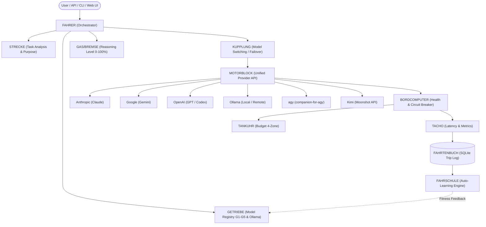

<p align="center">
  
</p>

[English](README.md) · [Deutsch](README_de.md) · [Español](README_es.md) · [简体中文](README_zh-Hans.md) · [日本語](README_ja.md) · [Русский](README_ru.md)

# clutch

> Provider-neutrale LLM-Orchestrierungsengine mit automatischem Lernen

[](https://www.python.org/)
[](LICENSE)
[](https://github.com/ellmos-ai/clutch/releases)
[](https://github.com/ellmos-ai/clutch)
[](https://github.com/ellmos-ai/clutch)
[](SECURITY.md)
[](https://github.com/ellmos-ai)
[](https://github.com/open-bricks)
[](llms.txt)

**clutch** (deutsch: *Kupplung*) verwendet eine Fahrmetapher, um Aufgaben intelligent an optimale LLM-Modelle verschiedener Anbieter weiterzuleiten. Das System analysiert Aufgabenkomplexität und -zweck, wählt das passende Modell und Reasoning-Level, verfolgt Budgets und lernt aus Erfahrungen. Verwendbar als **Bibliothek**, **CLI** oder **lokale Web-App**.

> [!NOTE]
> Für KI-Agenten und automatisierte Indexierer stehen maschinenlesbare Zusammenfassungs- und Suchmetadaten in [llms.txt](llms.txt) bereit.

## Funktionen

- **Provider-neutral** -- Anthropic (Claude), Google (Gemini), OpenAI (GPT/Codex), Ollama (lokal & remote), Claude Code, **agy via companion-for-agy** sowie **Kimi** (Moonshot API / CLI / Ollama Cloud)
- **Automatisches Routing** -- analysiert Aufgabenkomplexität *und Zweck* (Coding, Vision, Recherche, Bulk) und wählt optimales Modell + Reasoning-Level
- **Zweck- und Vision-bewusst** -- leitet Bild-/Dokumenteingaben an vision-fähige Modelle weiter; passt Aufgaben an Modellstärken an
- **CLI + Web-UI** -- `clutch route/run/chat/models/stats`, plus optionale FastAPI-Web-Chat-Oberfläche (`clutch serve --web`)
- **Credential-Speicher** -- API-Keys sicher in `~/.clutch/credentials.json` ablegen (`clutch keys ...`); Umgebungsvariablen haben Vorrang
- **Modell-Erkennung** -- automatische Erkennung installierter Ollama-Modelle (lokal/remote) und OpenAI-kompatibler `/v1/models`-Endpunkte
- **Budget-Tracking** -- Tankuhr mit vier Zonen (grün/gelb/orange/rot) mit täglichen und monatlichen Limits
- **Lernengine** -- Fitness-Scoring und Epsilon-Greedy-Exploration, die das Routing im Laufe der Zeit verbessert
- **Ausführungsmuster** -- Einzelaufgaben, Ketten (Kolonne), parallele Teams und Schwarm-Verarbeitung
- **Gesundheitsüberwachung** -- Circuit-Breaker, Latenz-Tracking, Overkill/Token-Explosion-Alarme, Provider-Failover
- **SQLite-Metriken** -- persistentes Fahrtenbuch, Chat-Sitzungen, Prompt-Bibliothek und Profile

## Architektur

Das gesamte System folgt einer **Auto-/Fahrmetapher**:



```
                    +----------------------------------+
                    |            FAHRER                 |
                    |        (Driver / Orchestrator)    |
                    |     Any LLM: Opus, Gemini, ...   |
                    +--------+----------+--------------+
                             |          |
                +------------+          +-------------+
                |                                     |
        +-------v--------+                   +--------v-------+
        |    STRECKE      |                   |    GETRIEBE    |
        | (Road / Task    |                   | (Gearbox /     |
        |  Analysis)      |                   |  Model Registry|
        +----------------+                   |                |
                                              | G1: Haiku      |
        +----------------+                   | G2: Flash      |
        |   GAS / BREMSE  |                   | G3: Sonnet     |
        | (Throttle/Brake |                   | G4: Gemini Pro |
        |  Reasoning Lvl) |                   | G5: Opus       |
        +----------------+                   | + Ollama local |
                                              +----------------+
        +----------------+
        |    KUPPLUNG     |    +------------+    +-------------+
        | (Clutch / Model |    |   TACHO    |    |  TANKUHR    |
        |  Switching)     |    | (Metrics)  |    | (Budget)    |
        +----------------+    +------------+    +-------------+
```

| Komponente | Rolle | Modul |
|-----------|------|--------|
| **Fahrer** (Fahrer) | Orchestrator -- wählt Modell, Reasoning und Ausführungsmuster | `fahrer.py` |
| **Strecke** (Strecke) | Aufgabenanalyse und -klassifikation | `strecke.py` |
| **Getriebe** (Getriebe) | Provider-neutrale Modell-Registry | `getriebe.py` |
| **Gang** (Gang) | Ein konkretes Modell (G1--G5) | `getriebe.py` |
| **Gas/Bremse** (Gas/Bremse) | Reasoning-Level (0--100 %) | `gas_bremse.py` |
| **Kupplung** (Kupplung) | Modell-Wechselmechanismus | `kupplung.py` |
| **MotorBlock** (Motorblock) | Einheitliche API-Aufrufschicht | `motorblock.py` |
| **Tacho** (Tacho) | Metriken-Erfassung | `tacho.py` |
| **Tankuhr** (Tankuhr) | Budget-Tracking (4 Zonen) | `tankuhr.py` |
| **Bordcomputer** (Bordcomputer) | Gesundheitsmonitor, Circuit-Breaker | `bordcomputer.py` |
| **Fahrtenbuch** (Fahrtenbuch) | SQLite-Metrikspeicher | `fahrtenbuch.py` |
| **Fahrschule** (Fahrschule) | Lern- / Evolutionsengine | `fahrschule.py` |
| **Token-Durchsatz** (Schatten-Zone, Stufe 1) | Anthropic-5h/7d-Fenster als zweite, rein informative Zone neben der Tankuhr-USD-Zone -- siehe [`docs/STAGED-MIGRATION.md`](docs/STAGED-MIGRATION.md) | `token_throughput.py` |

## Streckentypen

| Strecke | Schwierigkeit | Standard-Gang | Gas | Muster |
|------|-----------|-------------|----------|---------|
| Feldweg (Dirt road) | Trivial | Haiku (G1) | 30 % | Einzelfahrt |
| Landstrasse (Country road) | Standard | Sonnet (G3) | 50 % | Einzelfahrt |
| Bundesstrasse (Highway) | Bugfix | Sonnet (G3) | 70 % | Einzelfahrt |
| Autobahn (Motorway) | Architektur | Opus (G5) | 90 % | Einzelfahrt |
| Rallye (Rally) | Bulk-Ops | Haiku (G1) | 30 % | Schwarm |
| Konvoi (Convoy) | Pipeline | Sonnet (G3) | 50 % | Kette |
| Teamfahrt (Team drive) | Multi-File | Sonnet (G3) | 50 % | Team |
| Langstrecke (Long distance) | Komplex | Opus (G5) | 90 % | Hybrid |

## Installation

```bash
git clone https://github.com/ellmos-ai/clutch.git
cd clutch
pip install -e .
```

### Voraussetzungen

- Python 3.10+
- API-Keys für gewünschte Anbieter (als Umgebungsvariablen):
  - `ANTHROPIC_API_KEY` für Claude-Modelle
  - `GOOGLE_API_KEY` für Gemini-Modelle
  - `OPENAI_API_KEY` für GPT- und Codex-Modelle
  - `MOONSHOT_API_KEY` für Kimi-API-Modelle
  - Lokal laufendes Ollama für lokale Modelle

## Schnellstart

```python
from clutch import Fahrer

# Create a driver (uses all configured providers)
fahrer = Fahrer()

# Describe your task -- the driver handles everything
result = fahrer.fahren(
    "Fix the authentication bug in the login module",
    handler=my_handler,
)

# Inspect what was chosen
print(result.config.gang.name)       # "claude-sonnet"
print(result.config.gang.provider)   # "anthropic"
print(result.config.gas.wert)        # 0.7

# Dashboard
status = fahrer.status()
print(status["tankuhr"]["zone"])     # "green"
print(status["getriebe"])            # "Getriebe[haiku(G1), flash(G2), ...]"

# Learn from past runs
fahrer.trainieren()
```

## Kommandozeilen-Interface

Nach `pip install -e .` ist der Befehl `clutch` verfügbar:

```bash
clutch route "Fix the auth bug"      # show the routing decision (dry-run, no LLM call)
clutch "Explain quantum computing"    # one-shot: route + execute, print the answer
clutch run "..." --json               # machine-readable output (for other agents)
clutch chat                           # interactive REPL
clutch models [--json]                # list all gears (models)
clutch stats                          # usage / budget / health dashboard
clutch config <key> [value]           # read/set CLI settings
clutch keys set MOONSHOT_API_KEY      # store an API key (hidden input; values never shown)
clutch keys list                      # list stored key names (not values)
clutch serve --web                    # start the web UI (needs: pip install clutch[web])
```

Drei Nutzungsmodi: **Konsole** (Menschen), **Web-UI** (Menschen, grafisch) und **CLI/API**
(andere LLMs/Agenten leiten Aufgaben via `--json` oder den OpenAI-kompatiblen Web-Endpunkt weiter).

## API-Keys & Zugangsdaten

clutch löst Keys in dieser Reihenfolge auf (erster nicht leerer Wert gewinnt):

1. Umgebungsvariable (z. B. `MOONSHOT_API_KEY`) -- bevorzugt für CI/Server
2. clutch-Speicher `~/.clutch/credentials.json` (via `clutch keys set`, Dateimodus 0600)
3. `~/.credentials/<name>`-Dateien (Interoperabilität mit Schwester-Tools)

Werte werden niemals ausgegeben, geloggt oder committet.

## Konfiguration

Die Standardkonfiguration liegt in `clutch/config/`, sodass bearbeitbare Installationen und Wheels dieselben gebündelten Routing-Standardwerte verwenden. Übergib einen eigenen `base_dir` mit eigenem `config/`-Ordner an `Fahrer`, um projektspezifische Überschreibungen zu nutzen.

| Datei | Zweck |
|------|---------|
| `kupplung.json` | Globale Einstellungen (Fahrer-Standardwerte, Schwarm-Limits, Budget) |
| `getriebe.json` | Alle Gänge + Provider-Zuordnungen |
| `strecken.json` | Streckentyp-zu-Gang/Gas/Effort-Zuordnung |
| `fitness_criteria.json` | Schwellenwerte der Lernengine |

### Reasoning-Effort

Modellwahl und Reasoning-Effort sind orthogonal: clutch entscheidet **welches
Modell** (Gang) und hält im optionalen Feld `effort` fest, **wie tief** ein
kompatibler Agent arbeiten soll. Aufgabenklassen in `strecken.json` können
verwenden:

- `high` für routinemäßige, klar begrenzte Arbeit
- `xhigh` als reguläres gründliches Session-Level
- `max-delegate` für einen transparent angekündigten, gezielten Max-Worker beim
  härtesten Einzelschritt; dadurch entsteht kein dauerhafter Max-Modus

Aufrufer können die Empfehlung für genau einen Aufruf mit
`kontext={"effort": "high"}` überschreiben. `ultracode` ist bewusst kein
Effort-Wert: Es beschreibt Breite (Team-/Schwarm-Fan-out), nicht tiefere
Analyse; teure Fan-outs brauchen weiterhin eine ausdrückliche Bestätigung.
Lange Rechenarbeit wird in beobachtbare Schritte zerlegt. Dauert ein einzelner
Schritt voraussichtlich etwa 10--15 Minuten oder länger, gehört dieser Schritt
auf den Mac-Studio-Compute-Pfad.

### Budget-Zonen

| Zone | Auslastung | Erlaubte Gänge |
|------|-------|--------------|
| Grün | 0--30 % | Alle (G1--G5) |
| Gelb | 30--60 % | G1--G3 |
| Orange | 60--80 % | Nur G1--G2 |
| Rot | 80--100 % | Keine (Budget erschöpft) |

## Unterstützte Anbieter

| Anbieter | Modelle | Lokal |
|----------|--------|-------|
| **Anthropic** | Claude Fable 5, Haiku, Sonnet, Opus | Nein |
| **Google** | Gemini 3.7 Flash (bevorzugt), Gemini 3.5 Flash als Fallback, Gemini 3.1 Pro Preview | Nein |
| **OpenAI** | GPT-5.6 Luna/Terra/Sol via Responses API, GPT-5.3-Codex | Nein |
| **Ollama** | Qwen, Mistral und weitere (lokal & remote) | Ja |
| **Claude Code** | Via Subprocess (CLI-Session) | Ja |
| **agy** | Live ermittelter Gemini-, Claude- und GPT-OSS-Katalog via `companion-for-agy` | CLI-Session |
| **Kimi (Moonshot)** | `kimi-k2.7-code`, `kimi-k2.6` via OpenAI-kompatibler API; `kimi-cli`/`kimi-code` CLI; Ollama Cloud | API / CLI |
| **OpenAI-kompatibel** | Jeder `/v1/chat/completions`-Endpunkt (set `base_url`) | Nein |

### GPT-5.6-Kosten und empirisches Routing

Die GPT-5.6-Preise sind versioniert im Modellkatalog hinterlegt und werden gemeinsam von Laufzeit-Telemetrie, Tankuhr, CLI-/API-JSON und Statistik verwendet. Der Rechner unterscheidet beobachtete, angenommene und unbekannte Usage; fehlende Provider-Usage bleibt ungemessen (`cost_usd=null`) und wird nicht als Nullkosten ausgegeben. Cached Input, Cache-Schreibvorgänge, die Langkontext-Multiplikatoren oberhalb von 272.000 Input-Tokens, Standard/Fast, Tool-Gebühren und Reasoning-Tokens werden nachvollziehbar berücksichtigt.

```bash
clutch cost --model gpt-5.6-terra --input 100000 --cached-input 20000 --output 10000 --json
```

Alle drei GPT-5.6-Modelle unterstützen `none`, `low`, `medium`, `high`, `xhigh` und `max`. Ein höherer Effort erlaubt mehr Reasoning, garantiert aber weder monoton mehr sichtbare Tokens noch universell bessere Ergebnisse. Das Routing verwendet deshalb je Aufgabenklasse Qualitäts-/Latenz-Gates und erwartete Kosten pro erfolgreicher Aufgabe auf einer Pareto-Frontier. Ohne genügend gelabelte Beobachtungen meldet es einen rollenbasierten Cold-Start, statt Werte zu erfinden.

Siehe [GPT-5.6-Kosten und Routing](docs/GPT56_COST_ROUTING_de.md), die [Beispieleingabe](docs/gpt56_cost_example.json) und die generierte [Preisgrafik](docs/gpt56_price_facts.svg).

## Ausführungsmuster

- **Einzelfahrt** -- ein Modell, eine Aufgabe
- **Kolonne (Convoy)** -- sequentielle Kette, Output N wird Input N+1
- **Team** -- parallele spezialisierte Worker, Ergebnisse zusammengeführt
- **Schwarm** -- massiv parallele Mikrotasks (z. B. 20x Haiku), dann Aggregation

## Projektstruktur

```
clutch/
+-- clutch/
|   +-- __init__.py
|   +-- fahrer.py          # Orchestrator
|   +-- strecke.py         # Task analysis
|   +-- getriebe.py        # Model registry
|   +-- kupplung.py        # Model switching
|   +-- motorblock.py      # Unified API layer
|   +-- gas_bremse.py      # Reasoning level
|   +-- fahrtenbuch.py     # SQLite metrics
|   +-- bordcomputer.py    # Health monitor
|   +-- tankuhr.py         # Budget tracking
|   +-- tacho.py           # Metrics
|   +-- fahrschule.py      # Learning engine
|   +-- patterns/
|       +-- kolonne.py     # Chain pattern
|       +-- team.py        # Parallel pattern
|       +-- schwarm.py     # Swarm pattern
|       +-- hybrid.py      # Hybrid pattern
|   +-- config/
|       +-- kupplung.json
|       +-- getriebe.json
|       +-- strecken.json
|       +-- fitness_criteria.json
+-- tests/
|   +-- test_clutch.py
|   +-- test_learning.py
|   +-- test_patterns.py
|   +-- test_route.py
+-- data/                  # Runtime data (not tracked)
```

## Tests

```bash
pip install -e . pytest
pytest -q
```

Pytest ist so konfiguriert, dass nur `tests/` erfasst wird. Skripte im Stammverzeichnis wie
`demo.py`, `live_test.py` und `claude_code_test.py` sind manuelle Anbieter-Checks.

## Mitwirken

Siehe [CONTRIBUTING.md](CONTRIBUTING.md) für Richtlinien.
Zu den deutschen Auto-API-Begriffen siehe [GLOSSARY.md](GLOSSARY.md).

## Lizenz

MIT-Lizenz. Siehe [LICENSE](LICENSE) für Details.

---

## Deutsch

### Glossar: Code-Begriffe

| Deutsch (Code) | Englisch | Beschreibung |
|----------------|----------|--------------|
| **Fahrer** | Driver | Der Orchestrator -- wählt Modell, Reasoning-Level und Ausführungsmuster |
| **Strecke** | Road / Route | Der Task bzw. die Aufgabe, die analysiert und klassifiziert wird |
| **Getriebe** | Gearbox | Die Modell-Registry -- verwaltet alle Gänge über alle Provider |
| **Gang** | Gear | Ein konkretes LLM-Modell (G1=Haiku bis G5=Opus) |
| **Kupplung** | Clutch | Der Schaltmechanismus -- entscheidet wann und wie zwischen Modellen gewechselt wird |
| **Gas / Bremse** | Throttle / Brake | Reasoning-Level: Gas = gründlicher (mehr Tokens), Bremse = direkter (weniger) |
| **MotorBlock** | Engine Block | Die einheitliche API-Aufrufschicht für alle Provider |
| **Tacho** | Speedometer | Metriken-Erfassung während der Task-Ausführung |
| **Tankuhr** | Fuel Gauge | Budget-Tracking mit 4 Zonen (grün/gelb/orange/rot) |
| **Bordcomputer** | Onboard Computer | Health-Monitor mit Circuit-Breaker und Anomalie-Erkennung |
| **Fahrtenbuch** | Trip Log | SQLite-basierter Metrik-Speicher für alle Fahrten |
| **Fahrschule** | Driving School | Lernengine -- optimiert das Routing durch Fitness-Scoring |

### Streckentypen (Task-Klassifikation)

| Strecke | Schwierigkeit | Beispiel |
|---------|--------------|----------|
| **Feldweg** | Trivial | Tippfehler, Formatierung, Kommentare |
| **Landstrasse** | Standard | Feature-Entwicklung, einfaches Refactoring |
| **Bundesstrasse** | Mittel | Bugfixes, Debugging |
| **Autobahn** | Hoch | Architektur-Design, System-Migration |
| **Prüfstrecke** | Review | Code-Review, Qualitätsprüfung |
| **Rallye** | Bulk | Massenformatierung, Batch-Operationen |
| **Konvoi** | Pipeline | Sequentielle Verarbeitung (Output N → Input N+1) |
| **Teamfahrt** | Parallel | Multi-File-Features, parallele Spezialisten |
| **Langstrecke** | Komplex | Große mehrstufige Projekte (Hybrid-Muster) |
| **Testfahrt** | Tests | Automatische Test-Generierung |

### Ausführungsmuster

| Muster | Metapher | Beschreibung |
|--------|----------|--------------|
| **Einzelfahrt** | Ein Auto | Ein Modell, ein Task |
| **Kolonne** | Fahrzeugkolonne | Sequentiell -- Output von Schritt N wird Input für N+1 |
| **Team** | Fahrgemeinschaft | Parallel -- spezialisierte Worker, Ergebnisse zusammengeführt |
| **Schwarm** | Autobahnverkehr | Massiv parallel -- viele günstige Worker für Mikrotasks |
| **Hybrid** | Rallye mit Etappen | Kombination aus Kolonne- und Team-Phasen |

### Kurzanleitung

```python
from clutch import Fahrer

fahrer = Fahrer()

ergebnis = fahrer.fahren(
    "Fix den Bug in der Auth-Komponente",
    handler=mein_handler,
)

print(ergebnis.config.gang.name)    # "claude-sonnet"
print(ergebnis.config.gas.wert)     # 0.7
print(fahrer.status()["tankuhr"])   # Budget-Stand
```

## Verwandte Tools & Ökosystem

Teil der [ellmos-ai](https://github.com/ellmos-ai) Multi-Agenten-Infrastruktur und des übergreifenden [open-bricks](https://github.com/open-bricks) Open-Source-Software-Ökosystems:

| Tool | Organisation | Beschreibung |
|------|--------------|--------------|
| [coma](https://github.com/ellmos-ai/coma) | ellmos-ai | Single-Binary Multi-Agenten-Orchestrator und Ausführungskoordinator |
| [swarm-ai](https://github.com/ellmos-ai/swarm-ai) | ellmos-ai | Schwarmintelligenz- und Konsens-Engine für autonome Agenten |
| [system-explorer](https://github.com/ellmos-ai/system-explorer) | ellmos-ai | Lokale System- und Hardware-Ressourcen-Erkennung für Agenten |
| [policy-registry](https://github.com/ellmos-ai/policy-registry) | ellmos-ai | Einheitliche Berechtigungs- und Policy-Engine für Agentensysteme |
| [sqlite-transit-sync](https://github.com/ellmos-ai/sqlite-transit-sync) | ellmos-ai | Multi-Agenten-Zustandssynchronisation über SQLite-WAL-Journale |
| [workflowhooker](https://github.com/ellmos-ai/workflowhooker) | ellmos-ai | Event-Hooks und Agenten-Workflow-Automatisierungstrigger |
| [memoryhooker](https://github.com/ellmos-ai/memoryhooker) | ellmos-ai | Transparente SQLite/FTS5-Arbeitsgedächtnis-Erfassung für Agenten |
| [DevCenter](https://github.com/dev-bricks/DevCenter) | dev-bricks | Entwickler-Kontrollzentrum, Repository-Dashboard und Umgebungsmanager |
| [CodeBox](https://github.com/dev-bricks/CodeBox) | dev-bricks | Mehrsprachiger Code-Snippet-Manager und Entwickler-Workbench |

---

## Haftung / Liability

Dieses Projekt ist eine **unentgeltliche Open-Source-Schenkung** im Sinne der §§ 516 ff. BGB. Die Haftung des Urhebers ist gemäß **§ 521 BGB** auf **Vorsatz und grobe Fahrlässigkeit** beschränkt. Ergänzend gelten die Haftungsausschlüsse aus GPL-3.0 / MIT / Apache-2.0 §§ 15–16 (je nach gewählter Lizenz).

Nutzung auf eigenes Risiko. Keine Wartungszusage, keine Verfügbarkeitsgarantie, keine Gewähr für Fehlerfreiheit oder Eignung für einen bestimmten Zweck.

This project is an unpaid open-source donation. Liability is limited to intent and gross negligence (§ 521 German Civil Code). Use at your own risk. No warranty, no maintenance guarantee, no fitness-for-purpose assumed.
