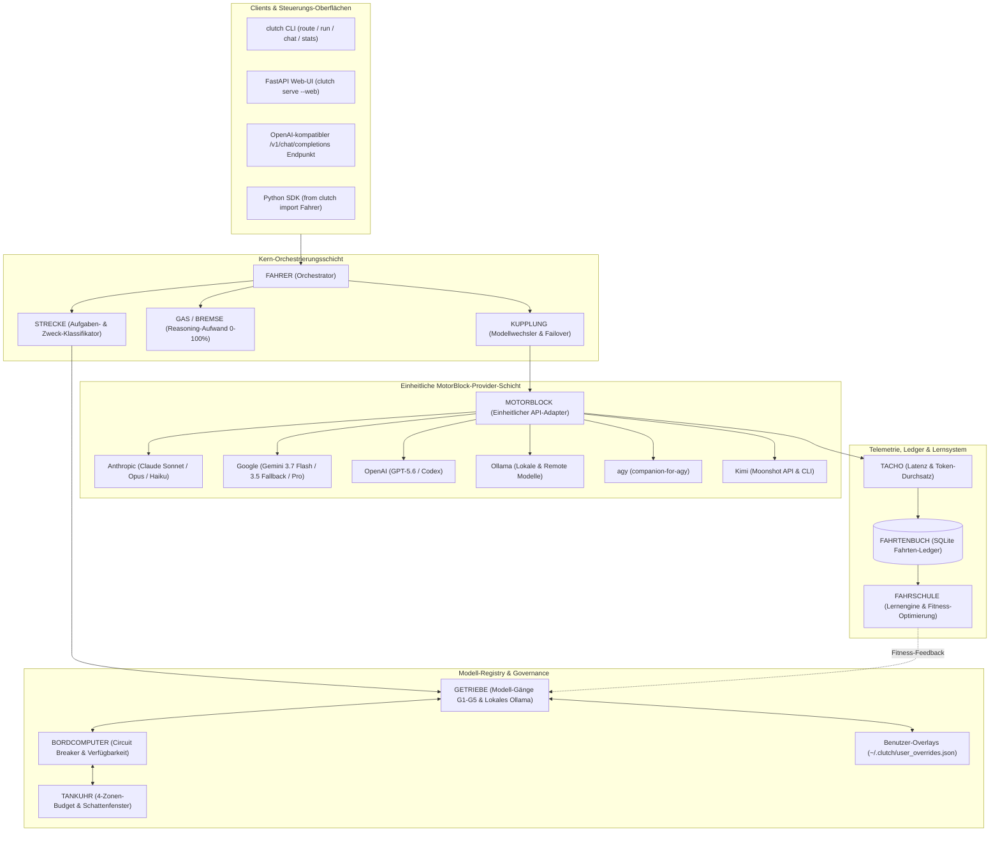
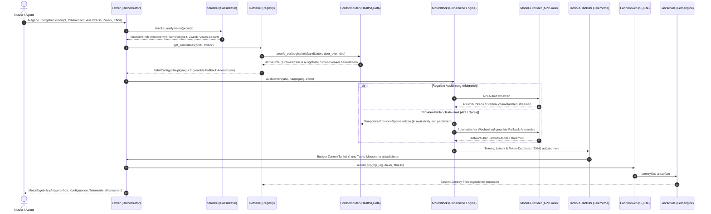

<p align="center">
  
</p>

[English](README.md) · [Deutsch](README_de.md) · [Español](README_es.md) · [简体中文](README_zh-Hans.md) · [日本語](README_ja.md) · [Русский](README_ru.md)

# clutch

> Provider-neutrale LLM-Orchestrierungsengine und Modell-Router mit automatischem Lernen

[](https://github.com/ellmos-ai/clutch/releases)
[](https://github.com/ellmos-ai/clutch/actions)
[](https://github.com/ellmos-ai/clutch)
[](https://www.python.org/)
[](https://github.com/ellmos-ai/clutch)
[](LICENSE)
[](https://github.com/ellmos-ai/clutch)
[](SECURITY.md)
[](SECURITY.md)
[](SECURITY.md)
[](https://github.com/ellmos-ai)
[](https://github.com/open-bricks)
[](llms.txt)

**clutch** (deutsch: *Kupplung*) verwendet eine intuitive automobile Fahrmetapher, um Aufgaben intelligent an optimale LLM-Modelle verschiedener Anbieter weiterzuleiten. Das System analysiert Aufgabenkomplexität und -zweck, wählt die passende Gangstufe und das ideale Reasoning-Level, verfolgt Budgets mit einer Vier-Zonen-Tankuhr, setzt persistente Circuit-Breaker durch und lernt aus Erfahrungen. Verwendbar als **Bibliothek**, **CLI** oder **lokale Web-App**.

> [!NOTE]
> Für KI-Agenten, Crawler und automatisierte Indexierer stehen maschinenlesbare Metadaten und Entdeckungskontexte in [llms.txt](llms.txt) bereit.

---

## Schnellnavigation
1. [Funktionen & Highlights](#funktionen)
2. [Architektur & Metaphern-Abbildung](#architektur)
3. [Duale Mermaid-Diagramme](#duale-mermaid-diagramme)
4. [Governance- & Laufzeit-Invarianten](#governance--laufzeit-invarianten)
5. [Streckentypen & Aufgabenklassifikation](#streckentypen)
6. [Installation & Voraussetzungen](#installation)
7. [Kurzanleitung](#kurzanleitung)
8. [Kommandozeilen-Schnittstelle (CLI)](#kommandozeilen-schnittstelle)
9. [API-Keys & Zugangsdaten](#api-keys--zugangsdaten)
10. [Konfiguration & Benutzer-Overlays](#konfiguration)
11. [Unterstützte Provider & Modell-Gänge](#unterst%C3%BCtzte-provider)
12. [Ausführungsmuster](#ausf%C3%BChrungsmuster)
13. [Verwandte Tools & Ökosystem](#verwandte-tools--%C3%B6kosystem)
14. [Sicherheitsrichtlinie & Haftung](#sicherheitsrichtlinie--haftung)

---

## Funktionen

- **Provider-neutral** -- Anthropic (Claude), Google (Gemini), OpenAI (GPT/Codex), Ollama (lokal & remote), Claude Code, **agy via companion-for-agy** sowie **Kimi** (Moonshot API / CLI / Ollama Cloud)
- **Automatisches Routing** -- analysiert Aufgabenkomplexität *und Zweck* (Coding, Vision, Recherche, Bulk) und wählt optimales Modell + Reasoning-Level
- **Zweck- und Vision-bewusst** -- leitet Bild-/Dokumenteingaben an vision-fähige Modelle weiter; passt Aufgaben an Modellstärken an
- **CLI + Web-UI** -- `clutch route/run/chat/models/stats`, plus optionale FastAPI-Web-Chat-Oberfläche (`clutch serve --web`)
- **Credential-Speicher** -- API-Keys sicher in `~/.clutch/credentials.json` ablegen (`clutch keys ...`); Umgebungsvariablen haben Vorrang
- **Modell-Erkennung** -- automatische Erkennung installierter Ollama-Modelle (lokal/remote) und OpenAI-kompatibler `/v1/models`-Endpunkte
- **Budget-Tracking** -- Tankuhr mit vier Zonen (grün/gelb/orange/rot) mit täglichen und monatlichen Limits
- **Lernengine** -- Fitness-Scoring und Epsilon-Greedy-Exploration, die das Routing im Laufe der Zeit verbessert
- **Ausführungsmuster** -- Einzelaufgaben, Ketten (Kolonne), parallele Teams und Schwarm-Verarbeitung
- **Persistente Verfügbarkeit** -- Circuit-Breaker und Kontingentsperren überleben One-Shot-Prozesse; rote Anthropic-5h/7d-Fenster, `notaus` und Provider-Rate-Limits werden bis zum Reset umgangen
- **Update-festes Nutzer-Overlay** -- Modelle deaktivieren, Modelle/Provider bevorzugen, Gangstufen begrenzen, Aliase und Modellkosten in `~/.clutch/user_overrides.json` pflegen
- **Routing-Wünsche pro Aufruf** -- Gänge bevorzugen oder ausschließen, Zweck/Effort überschreiben und zwei gerankte Fallback-Alternativen erhalten
- **Gesundheitsüberwachung** -- persistente Circuit-Breaker, Latenz-Tracking, Overkill/Token-Explosion-Alarme, Provider-Failover
- **SQLite-Metriken** -- persistentes Fahrtenbuch, Chat-Sitzungen, Prompt-Bibliothek und Profile

---

## Architektur

Das gesamte System folgt einer **Auto-/Fahrmetapher**:

```
                    +----------------------------------+
                    |            FAHRER                 |
                    |        (Driver / Orchestrator)    |
                    |     Any LLM: Opus, Gemini, ...   |
                    +--------+----------+--------------+
                             |          |
                +------------+          +-------------+
                |                                     |
        +-------v--------+                   +--------v-------+
        |    STRECKE      |                   |    GETRIEBE    |
        | (Road / Task    |                   | (Gearbox /     |
        |  Analysis)      |                   |  Model Registry|
        +----------------+                   |                |
                                              | G1: Haiku      |
        +----------------+                   | G2: Flash      |
        |   GAS / BREMSE  |                   | G3: Sonnet     |
        | (Throttle/Brake |                   | G4: Gemini Pro |
        |  Reasoning Lvl) |                   | G5: Opus       |
        +----------------+                   | + Ollama local |
                                              +----------------+
        +----------------+
        |    KUPPLUNG     |    +------------+    +-------------+
        | (Clutch / Model |    |   TACHO    |    |  TANKUHR    |
        |  Switching)     |    | (Metrics)  |    | (Budget)    |
        +----------------+    +------------+    +-------------+
```

| Komponente | Rolle | Modul |
|-----------|------|--------|
| **Fahrer** (Driver) | Orchestrator -- wählt Modell, Reasoning und Ausführungsmuster | `fahrer.py` |
| **Strecke** (Road) | Aufgabenanalyse und -klassifikation | `strecke.py` |
| **Getriebe** (Gearbox) | Provider-neutrale Modell-Registry | `getriebe.py` |
| **Gang** (Gear) | Ein konkretes Modell (G1--G5) | `getriebe.py` |
| **Gas / Bremse** (Throttle/Brake) | Reasoning-Level (0--100%) | `gas_bremse.py` |
| **Kupplung** (Clutch) | Schaltmechanismus zwischen Modellen | `kupplung.py` |
| **MotorBlock** (Engine) | Einheitliche API-Aufrufschicht | `motorblock.py` |
| **Tacho** (Speedometer) | Metriken-Erfassung | `tacho.py` |
| **Tankuhr** (Fuel Gauge) | Budget-Tracking (4 Zonen) | `tankuhr.py` |
| **Bordcomputer** (Onboard Computer) | Health-Monitor, Circuit-Breaker | `bordcomputer.py` |
| **Fahrtenbuch** (Trip Log) | SQLite-Metrikspeicher | `fahrtenbuch.py` |
| **Fahrschule** (Driving School) | Lernengine / Auto-Tuning | `fahrschule.py` |
| **Token-Throughput** (Schattenzone) | Anthropic 5h/7d-Rate-Limit-Fenster als zweite Zone -- siehe [`docs/STAGED-MIGRATION.md`](docs/STAGED-MIGRATION.md) | `token_throughput.py` |

---

## Duale Mermaid-Diagramme

### 1. Systemarchitektur-Topologie



### 2. End-to-End Task- & Routing-Lebenszyklus



---

## Governance- & Laufzeit-Invarianten

| # | Invariante | Geltungsbereich | Betriebliche Garantie |
|---|------------|-----------------|-----------------------|
| **1** | **Provider-Agnostizismus & Zero Lock-in** | Engine | Keine feste Herstellerbindung; nahtloses Umschalten zwischen Anthropic, Google Gemini, OpenAI, Ollama und Kimi. |
| **2** | **100% Local-First & Zero Egress** | Netzwerk | Keine Tracking-, Analyse- oder Telemetrie-Abflüsse; Netzwerkverkehr entsteht ausschließlich zu konfigurierten Providern. |
| **3** | **Non-Elevation User Mode** | Prozess | Alle CLI-Befehle, Hintergrund-Worker und FastAPI-Server laufen strikt im unprivilegierten Benutzerkontext. |
| **4** | **Fail-Closed Circuit Breaker** | Zuverlässigkeit | Erschöpfte Quotas, rote Fenster und API-Fehler führen zu persistenten Sperren in `~/.clutch/availability.json` statt Endlosschleifen. |
| **5** | **Update-feste Nutzer-Overlays** | Konfiguration | Nutzerpräferenzen, Modellausschlüsse, Aliase und Kostenanpassungen in `~/.clutch/user_overrides.json` überleben Paket-Updates. |
| **6** | **Zwei gerankte Fallback-Alternativen** | Routing | Jede Routing-Entscheidung liefert verlässlich einen Hauptgang sowie zwei gerankte Fallback-Alternativen (`alternativen`). |
| **7** | **Zweidimensionale Telemetrie** | Budget | Kombiniert finanzielle USD-Verbrauchszonen (`Tankuhr`) mit realen Token-Durchsatz-Raten (`token_throughput.py`). |
| **8** | **Zweck- und Vision-Passgenauigkeit** | Klassifikation | Bild- und Dokumentaufgaben werden strikt an vision-fähige Modelle geroutet; Coding-Tasks erhalten spezialisierte Coding-Gänge. |
| **9** | **Transaktionssicheres SQLite-Ledger** | Persistenz | Alle Fahrten, Ausführungsdaten, Chat-Sitzungen und Prompt-Vorlagen werden ACID-konform lokal in SQLite gespeichert. |
| **10** | **Plattformübergreifende Multi-OS Parität** | Plattform | Vollständig identisches Verhalten, CLI-Ergonomie, Testabdeckung und Routing-Semantik unter Linux, Windows und macOS. |

---

## Streckentypen

| Strecke | Schwierigkeit | Standard-Gang | Gas/Throttle | Muster |
|---------|--------------|---------------|--------------|--------|
| **Feldweg** | Trivial | Haiku (G1) | 30% | Single |
| **Landstrasse** | Standard | Sonnet (G3) | 50% | Single |
| **Bundesstrasse** | Bugfix | Sonnet (G3) | 70% | Single |
| **Autobahn** | Architektur | Opus (G5) | 90% | Single |
| **Rallye** | Bulk ops | Haiku (G1) | 30% | Swarm |
| **Konvoi** | Pipeline | Sonnet (G3) | 50% | Chain |
| **Teamfahrt** | Multi-File | Sonnet (G3) | 50% | Team |
| **Langstrecke** | Komplex | Opus (G5) | 90% | Hybrid |

---

## Installation

```bash
git clone https://github.com/ellmos-ai/clutch.git
cd clutch
pip install -e .
```

### Optionale Web-Oberfläche
```bash
pip install -e .[web]
```

### Voraussetzungen
- Python 3.10+
- API-Schlüssel für gewünschte Provider (als Umgebungsvariablen oder via `clutch keys set`):
  - `ANTHROPIC_API_KEY` für Claude-Modelle
  - `GOOGLE_API_KEY` für Gemini-Modelle
  - `OPENAI_API_KEY` für GPT- und Codex-Modelle
  - `MOONSHOT_API_KEY` für Kimi-API-Modelle
  - Lokales Ollama für lokale Open-Source-Modelle

---

## Kurzanleitung

```python
from clutch import Fahrer

# Fahrer instanziieren (nutzt alle konfigurierten Provider)
fahrer = Fahrer()

# Aufgabe übergeben -- der Fahrer übernimmt Analyse und Ausführung
ergebnis = fahrer.fahren(
    "Fix den Authentifizierungsbug im Login-Modul",
    handler=mein_handler,
)

# Gewählte Konfiguration inspizieren
print(ergebnis.config.gang.name)       # "claude-sonnet"
print(ergebnis.config.gang.provider)   # "anthropic"
print(ergebnis.config.gas.wert)        # 0.7

# Dashboard abfragen
status = fahrer.status()
print(status["tankuhr"]["zone"])       # "green"
print(status["getriebe"])              # "Getriebe[haiku(G1), flash(G2), ...]"

# Aus bisherigen Fahrten lernen
fahrer.trainieren()
```

---

## Kommandozeilen-Schnittstelle

Nach `pip install -e .` steht das `clutch`-Kommando bereit:

```bash
clutch route "Fix den Auth-Bug"        # Zeigt Routing-Entscheidung (Dry-Run, kein API-Call)
clutch route "..." --prefer codex --exclude claude-sonnet --zweck coding --effort high
clutch "Erkläre Quantencomputing"     # One-Shot: Route + Ausführung, gibt Antwort aus
clutch run "..." --json                # Maschinenlesbare Ausgabe (für KI-Agenten)
clutch chat                            # Interaktive REPL-Sitzung
clutch models [--status] [--json]      # Modelle inklusive Verfügbarkeit & Sperrgrund
clutch models disable claude-sonnet    # Persistentes, update-festes Nutzer-Overlay
clutch models enable claude-sonnet
clutch config prefer openai            # Modell oder Provider dauerhaft bevorzugen
clutch stats                           # Nutzungs-, Budget- und Health-Dashboard
clutch config <key> [value]            # CLI-Einstellungen lesen/schreiben
clutch keys set MOONSHOT_API_KEY       # API-Key sicher speichern (Maskierte Eingabe)
clutch keys list                       # Gespeicherte Key-Namen auflisten (keine Werte)
clutch serve --web                     # Lokale Web-UI starten (benötigt: pip install clutch[web])
```

---

## API-Keys & Zugangsdaten

clutch löst Schlüssel in folgender Reihenfolge auf (der erste Treffer gewinnt):

1. Umgebungsvariable (z. B. `MOONSHOT_API_KEY`) -- bevorzugt für Server und CI
2. clutch-Store `~/.clutch/credentials.json` (via `clutch keys set`, Berechtigung 0600)
3. `~/.credentials/<name>`-Dateien (Interoperabilität mit Geschwistertools)

Schlüsselwerte werden niemals ausgegeben, geloggt oder in Git committet.

---

## Konfiguration

Standardkonfigurationen liegen in `clutch/config/`. Eigene Overlays werden in `~/.clutch/user_overrides.json` abgelegt:

```json
{
  "disabled_models": ["claude-sonnet"],
  "preferred_models": ["openai-codex"],
  "preferred_providers": ["openai"],
  "model_max_gang": {"openai-codex": 4},
  "aliases": {"codex": "openai-codex"},
  "model_cost_override": {
    "ollama-kimi-k2": {"kosten_input_1k": 0.001, "kosten_output_1k": 0.004}
  }
}
```

---

Die Bibliothek akzeptiert dieselben Wünsche wie die CLI:

```python
profil = fahrer.strecke_analysieren("Implementiere den Parser")
config = fahrer.kuppeln(
    profil,
    zweck="coding",
    effort_override="high",
    ausschluss=["claude-sonnet"],
    praeferenz=["codex", "openai"],
)
print(config.gang.name)
print(config.alternativen)  # zwei gerankte Fallback-Gänge
```

Harte Grenzen (deaktivierte/nicht verfügbare/ausgeschlossene Gänge, Budget,
Vertrauen und erforderliche Vision-Fähigkeit) gelten vor Präferenzen. Das
Route-JSON enthält immer `alternativen`.

### Reasoning-Effort

Modellwahl und Reasoning-Effort sind orthogonal: clutch entscheidet **welches
Modell** (Gang) und hält im optionalen Feld `effort` fest, **wie tief** ein
kompatibler Agent arbeiten soll. Aufgabenklassen in `strecken.json` können
verwenden:

- `high` für routinemäßige, klar begrenzte Arbeit
- `xhigh` als reguläres gründliches Session-Level
- `max-delegate` für einen transparent angekündigten, gezielten Max-Worker beim
  härtesten Einzelschritt; dadurch entsteht kein dauerhafter Max-Modus

Aufrufer können die Empfehlung für genau einen Aufruf mit
`kontext={"effort": "high"}` überschreiben. `ultracode` ist bewusst kein
Effort-Wert: Es beschreibt Breite (Team-/Schwarm-Fan-out), nicht tiefere
Analyse; teure Fan-outs brauchen weiterhin eine ausdrückliche Bestätigung.
Lange Rechenarbeit wird in beobachtbare Schritte zerlegt. Dauert ein einzelner
Schritt voraussichtlich etwa 10--15 Minuten oder länger, gehört dieser Schritt
auf den Mac-Studio-Compute-Pfad.

### Budget-Zonen

| Zone | Auslastung | Erlaubte Gänge |
|------|-------|--------------|
| Grün | 0--30 % | Alle (G1--G5) |
| Gelb | 30--60 % | G1--G3 |
| Orange | 60--80 % | Nur G1--G2 |
| Rot | 80--100 % | Keine (Budget erschöpft) |

`clutch/config/fitness_criteria.json` ist die einzige Laufzeitquelle für diese
Grenzen. Bordcomputer und Kupplung lesen dieselbe Policy; bei Rot stoppt das
Routing, bevor ein LLM ausgewählt wird.

---

## Unterstützte Provider

| Provider | Modelle | Lokal |
|----------|---------|-------|
| **Anthropic** | Claude Fable 5, Haiku, Sonnet, Opus | Nein |
| **Google** | Gemini 3.7 Flash (bevorzugt), Gemini 3.5 Flash als Fallback, Gemini 3.1 Pro Preview | Nein |
| **OpenAI** | GPT-5.6 Luna/Terra/Sol via Responses API, GPT-5.3-Codex | Nein |
| **Ollama** | Qwen, Mistral und weitere Open-Source-Modelle | Ja |
| **Claude Code** | Subprozess-CLI-Sitzung | Ja |
| **agy** | Live erkanntes Gemini-, Claude- und GPT-OSS-Inventar via `companion-for-agy` | CLI-Sitzung |
| **Kimi (Moonshot)** | `kimi-k2.7-code`, `kimi-k2.6` via OpenAI-kompatible API; `kimi-cli`/`kimi-code` CLI; Ollama Cloud | API / CLI |
| **OpenAI-kompatibel**| Beliebiger `/v1/chat/completions`-Endpunkt (`base_url` setzbar) | Nein / Lokal |

---

## Ausführungsmuster

- **Einzelfahrt (Single)** -- Ein Modell, ein Task
- **Kolonne (Convoy)** -- Sequentiell, Ausgabe N wird Eingabe für N+1
- **Team** -- Parallele spezialisierte Worker, Ergebnisse zusammengeführt
- **Schwarm (Swarm)** -- Massiv parallele Mikrotasks (z. B. 20x Haiku), danach Aggregation
- **Hybrid** -- Kombination aus Kolonnen- und Team-Phasen

---

## Verwandte Tools & Ökosystem

Teil der [ellmos-ai](https://github.com/ellmos-ai) Multi-Agenten-Infrastruktur und des übergeordneten [open-bricks](https://github.com/open-bricks) Open-Source-Ökosystems:

| Tool | Organisation | Beschreibung |
|------|--------------|-------------|
| [coma](https://github.com/ellmos-ai/coma) | ellmos-ai | Multi-Agenten-Orchestrator und Ausführungskoordinator |
| [swarm-ai](https://github.com/ellmos-ai/swarm-ai) | ellmos-ai | Schwarmintelligenz und autonomer Agentenkonsens |
| [system-explorer](https://github.com/ellmos-ai/system-explorer) | ellmos-ai | Lokale Systemerkennung und Ressourcen-Monitor |
| [policy-registry](https://github.com/ellmos-ai/policy-registry) | ellmos-ai | Einheitliche Berechtigungs- und Richtlinien-Engine |
| [sqlite-transit-sync](https://github.com/ellmos-ai/sqlite-transit-sync) | ellmos-ai | Multi-Agenten Zustandssynchronisation via SQLite WAL |
| [workflowhooker](https://github.com/ellmos-ai/workflowhooker) | ellmos-ai | Ereignis-Hooks und Agenten-Workflow-Trigger |
| [memoryhooker](https://github.com/ellmos-ai/memoryhooker) | ellmos-ai | Transparentes SQLite/FTS5-Arbeitsgedächtnis für Agenten |
| [agent-ops-stack](https://github.com/ellmos-ai/agent-ops-stack) | ellmos-ai | Operativer Sidecar-Stack für autonome Agenten |
| [convergence-reconciler](https://github.com/ellmos-ai/convergence-reconciler) | ellmos-ai | Modell-Konvergenzprüfung und Konsens-Engine |
| [DevCenter](https://github.com/dev-bricks/DevCenter) | dev-bricks | Entwickler-Leitstand, Repository-Dashboard und Umgebungsmanager |
| [CodeBox](https://github.com/dev-bricks/CodeBox) | dev-bricks | Polyglotter Code-Snippet-Manager und Entwickler-Werkbank |
| [open-bricks](https://github.com/open-bricks) | open-bricks | Dachorganisation für modulare Open-Source Softwarewerkzeuge |

---

## Sicherheitsrichtlinie & Haftung

Details zu unterstützten Versionen, Reaktionszeiten und Meldeverfahren finden sich in [SECURITY.md](SECURITY.md).

### Haftungsausschluss

Dieses Projekt ist eine **unentgeltliche Open-Source-Schenkung** im Sinne der §§ 516 ff. BGB. Die Haftung des Urhebers ist gemäß **§ 521 BGB** auf **Vorsatz und grobe Fahrlässigkeit** beschränkt. Ergänzend gelten die Haftungsausschlüsse der MIT-Lizenz.

Nutzung auf eigenes Risiko. Keine Wartungszusage, keine Verfügbarkeitsgarantie, keine Gewähr für Fehlerfreiheit oder Eignung für einen bestimmten Zweck.
